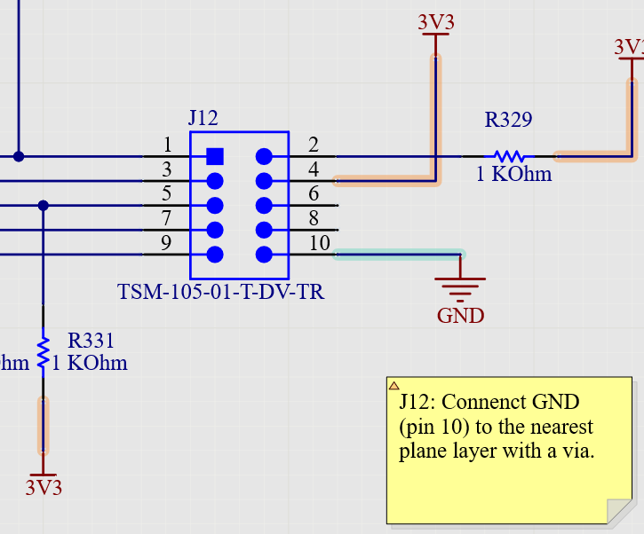
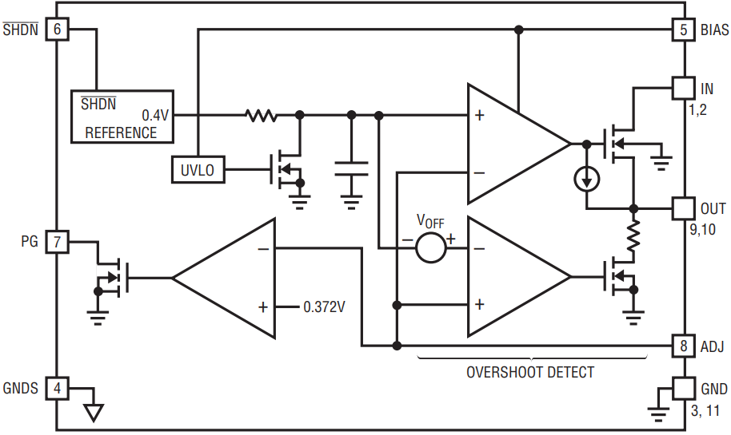
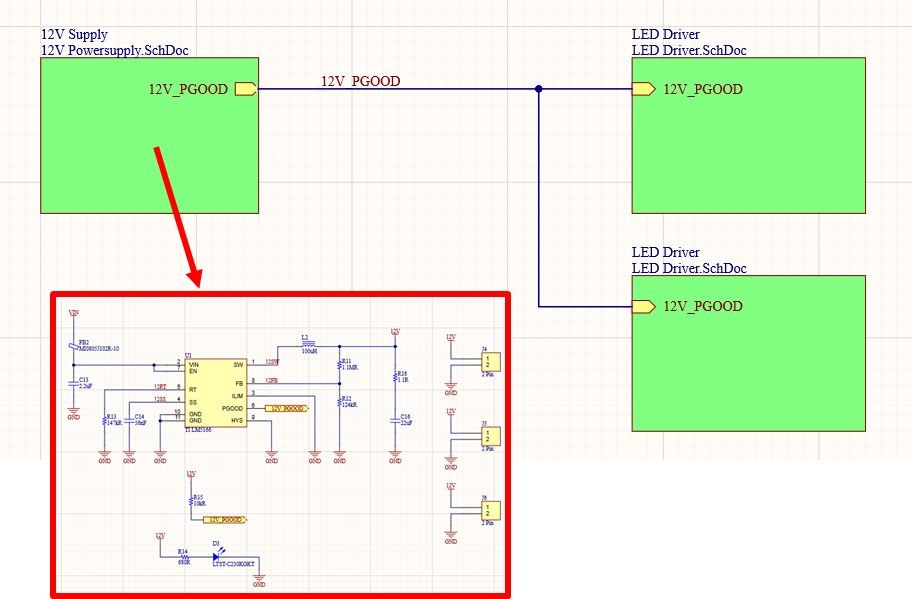
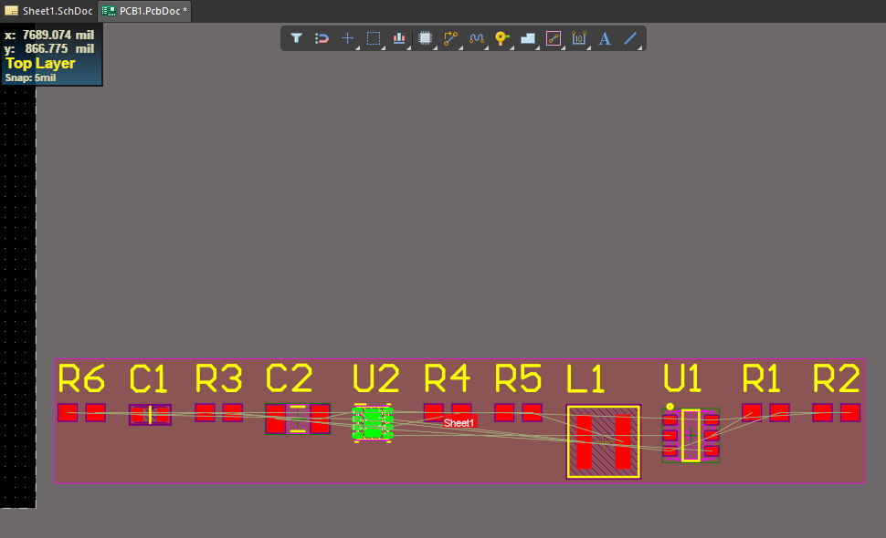

# UNIT II - Schematics and Libraries

## 1. Anatomy of a Schematic

### 1.1 Anatomy of a Schematic
- Circuit boards are works of art that take skill and creativity to design. But before a design can be turned into a circuit board layout, you need to create some basic drawings that define electrical connections in your design. These basic drawings are your schematics. These electrical drawings define all the connections that will be physically represented in the PCB layout. They serve many other uses too once the PCB is fabricated and assembled.
- Before getting into all the possible uses of schematics, we need to look at how they are created and what the different CAD objects in schematics represent. In this lesson, we'll cover some of the basic elements that appear in a schematic and expain their basic meaning. We'll also look at how to structure a schematic so that you can create easy-to-read electrical drawings.

#### 1.1.1 Important Elements in Schematics
- Very basic boards may only have enough circuitry to fit into a single schematic, while other boards could require dozens of schematic sheets to show all the possible circuits used to build a PCBA. No matter how many sheets are used to show the circuits in your PCB, all sheets have some common elements that are defined in industry standarts. This standardization helps ensure that you can read the same schematics in any ECAD application, and the schematics will always have a consistent meaning.
- To see how schematics work and really seee all the important portions of a schematic, let's look at an example from the MiniPC project in Altium Designer. This schematic shows a circuit for a 10-pin connector. This schematic and circuit are very simple, but the schematic constains many of the elements you'll find in many other example schematics.

- Sometimes, there will be a lot of blank space in a schematic, while other schematics can be very dense and complex. ECAD software allows you to use multiple schematics to build your device, so don't feel obligated to put every single circuit into the same schematic sheet.
- At the top of the schematic we have a title. The title should briefly explain what the circuit does. In this case, the connector makes a specific type of connection, called a JTAG connection. The use of JTAG is an advanced topic and we won't discuss it in this course.
- In the bottom-right area of the screen, we have a title block. The <code>Title</code> entry can be the same as the title placed at the top of the schematic, but this is not always the case. Some of the other important information that is standart is the company logo, company address, page size, number, and revision. The number is the same as a page number; in other words, this schematic is page #9 in a set of 46 schematics. The revision entry tells you the current iteration of the design and is equivalent to a version number.

- If you're familiar with title block used in MCAD programs like AutoCAD, this is probably isn't new. The main difference between electrical schematics and drawings you create in other CAD programs is the lack of units or other notes in or around the title block. The other important information doesn't need to be dimensioned and is instead placed around the schematics in an easy-to-read manner.
- Now let's look at the connector circuit in this schematics. The image below shows a zoomed-in view of this circuit : 

- Some of the items in the above schematic were introduced in the last unit, and they can be found in your glossary. We want to look at these in a bit more detail to see what each of these items means in your design. However, we first need to understand an important CAD object that defines the connections shown in the above schematic. This connection between different objects in a schematic is called a "net".

### 1.2 What is a Net ? 
- A net is an important concept in schematics and in PCB design. In fact, when designers refer to an electrical connection between two components, they won't use the term "electrical connection", they will instead call the connection a "net". The wires that we draw in schematics are the nets that make up our electrical connections. In other words, a net includes all sections of a wire between two or more points in a schematic. This means that a net is not just a straight wire between two components. A net can branch off into different sections to make connections between multiple components.
- All nets also have a name. In the below schematic, some of the nets have been assigned specific names. Note that, if you don't give a net a name, your ECAD software will assign a name automatically. Not all nets need to be given manual names as this can take a lot of time. It's not uncommon to see very complex boards have hundreds or even thousands of nets, and it might not make sense to give every net a name. 
- If you're in the PCB layout, you can see the net names by zooming into the component footprint. An example showing the corresponding PCB footprint for the 10-pin connector is shown below :

- From here, we can see some of the net names in the schematic placed on the component pads in the PCB layout. This includes names for our power net(named "3V3") and ground net(named "GND").

### 1.3 Power and Ground Ports 
- Some important points in the below image are the power and ground ports. These objects tell you how power is supplied to the device, as well as how grounds are connected in the PCB layout. Schematic editors, like the editor found in Altium Designer, allow you to place different symbols for different voltages and grounds that will appear in your PCB. The names on these symbols define power nets and ground nets in your design.

- **Names on Power Ports** : An important point to note here is that you are free to change the name attached to one of these symbols. It's best to name the power net after the voltage level and type of power(for example, +12V_DC), and you should use the same symbol for all connections in your schematics so that there will not be any confusion as to the function of that net.
- **Names on Ground Ports** : By default, schematic editors will name all ground nets "GND" regardless of the symbol you choose to represent ground. Each of the symbols represents a specific type of ground connection(earth ground, chassis ground, etc..), but these symbols can all correspond to the same net if they have the same name. If the symbols are meant to represent physically different ground connections, then they need to be given different names.

### 1.4 Notes in a Schematic
- You won't see notes in every schematic, but it is common to use notes to track changes to a schematic, or to give some guidance on how to layout some components in the schematic. Notes in schematics can also be used to make a request to an engineer for a specific change in the schematic. In Altium Designer, you can easily place notes in the schematic and add whatever text you like in the note. In the example below, a note has been added to our JTAG connector schematic requesting how the layout engineer should make the GND connection on component J12.

- A best practice when using notes in a schematic is to call out components using the reference designator and pin numbers. In the above example, the note calls out the JTAG connector(J12), pin number(pin 10), and the GND connection.

### 1.5 How Components Are Used in a Schematic
- Obviously, connectors and resistors aren't the only types of components that can be placed in a schematic. As we saw in the last unit, any component can be generally represented using a box, or using one of the fundamental symbols you'll use in circuit diagrams. Making connections to your components inside a schematic is very simple : Just connect wires between the pins on your components!
- For integrated circuits or other components that are represented using a box with pins, there is some additional information to understand when looking at a component in a schematic sheet. Take a look at the image shown below. On the left side of the image, a component(MPN : LTC3026EDD-1#PBF) from the MiniPC board has been isolated in a schematic sheet to show the various elements that make up a schematic symbol. The right side of the image shows an outline of the actual component taken from the datasheet, which includes the pin names and pin numbers on the real component.

- This arrangement of pins on the schematic symbol and the real component is called the **pinout**. The pin numbers and names on  the schematic symbol should always match the corresponding pin names and pin numbers written in the datasheet.
- Another way to view the various functions of different pins is to look at a functional block diagram for the component in the datasheet. An example for the LTC3026EDD-1#PBF is shown below. The block diagram also shows the pin numbers and names, and these should match the numbers and names used in the schematic symbol.

- If you're ever looking at a schematic symbol and you want to quickly find out the function of specific pins, you should look up the datasheet online. If you go to Google and enter the MPN(in this case, LTC3026EDD-1#PBF), you'll be able to quickly find the datasheet. Once you've opened the datasheet, look for a pinout diagram and read through the documentation for each pin. The datasheet will tell you how each of the pins should be used and what their functions are.

### 1.6 Multi-Part Symbols
- The component shown above only has 11 pins, so it's easy to display the entire component in a schematic. This is not always the case; some components are so large that they need to be represented in a schematic using multiple schematic symbols. For example, a large processor could have hundreds of pads, and each of these connections needs to be represented in a schematic symbol. The easiest way to do this is to separate groups of pins into multiple symbols in the schematic.
- This type of schematic symbol set is called a **multi-part symbol**. An example of a multi-part symbol is the USB bridge component(MPN : FT601Q) that was briefly introduced in the previous unit. This particular component is shown using two schematic symbols. In this example, the reference designator for the component is U33, but each symbol has been given the reference designators U33A and U33B. The standart way to denote each portion of a multi-part symbol is to add a letter at the end of the reference designator in succession. In other words, if the FT601Q was shown using 4 symbols, they would be designated from A to D in the schematic sheet.

- Even though this component is representing using two symbols, there is still only one component with only one PCB footprint. If you look in the PCB layout, you'll be able to clearly see a single footprint corresponding to this component. This is shown in the image below : 

### 1.7 Inputs, Outputs, and Bi-Directional Pins
- If you look at the above schematic symbols, you may have noticed some triangles on the ends of some of the pins in some symbols. These triangles specify whether the pin is an input, an output, or bi-directional. In other words, it tells you whether a pin sources or receives data(or both for a bi-directional pin).

- Note that you don't necessarily need to define every pin as an input or output. The default definition for a pin is <code>passive</code>, meaning its just receives or sources a static voltage. We'll look more at the different types of pins later in this unit when we discuss component creation.

### 1.8 Ports for Connections Between Schematics
- Finally, we need to think about how connections are made inside a schematic and between schematics. As was mentioned earlier, we can't possibly fit every component in a single schematic sheet. Consider the MiniPC example project for a moment; this project contains a total of 1033 components spread across 46 pages of schematics. We can't possibly fit all 1033 components in a single schematic and connect them together with wires. Once we place components into different schematic sheets, we need some way to define connections between different schematic sheets.
- In Altium Designer, these connections between schematic sheets are created using two objects : 
    1. Ports
    2. Harnesses
- A port is an object that is used to denote a single connection between two sheets. The best way to think of a harness is like a connection of multiple ports. If you look at the JTAG connector schematic below, there is a harness that has been given the name <code>JTAG</code> and includes 5 connections(named TCK, TDO, TMS, TRST and TDI). Note that ports and harnesses can be defined as inputs, outputs or bi-directional, just like pins on a schematic symbol.

- In the above example, we could just use a collection of 5 ports instead of a harness. If you're connecting multiple nets between two sheets, then you might want to just use a harness. However, if you're making connections involving a group of nets in one sheet, and the connections need to span across a group of other sheets, then it's best to use ports instead of a harness. We'll explain this in more detail later when we start creating an example schematic sheet. 
- Not all ECAD programs will use these CAD objects, and they may use different names for these types of connections. Be aware of this when working with other ECAD applications. Harnesses are an advanced type of CAD object in Altium Designer, so you're not comfortable using them, you should just stick to using ports.

### 1.9 Summary
- So far, we've taken a deep look at many of the possible objects that can appear in a typical schematic. The first schematics you create may not be this complex, but it's important to know what these various objects in a schematic mean so that you can understand other schematics as much as possible. In the next lesson, you'll have a chance to set up your first schematic and start creating projects in Altium Designer. You'll also get a brief introduction to some of the features you can use to place components in your design.

## 2.Types of Schematics

### 2.1 Types of Schematics
- In the previous lessons, we looked at how to create schematics and start using them in your designs. Now, we want to switch gears and look at some different types of schematics. This idea can be a bit misleading; all schematics are just CAD drawings showing electrical connections between components, so what other types of schematics could there be?
- There are two different types of schematics used in PCB design and that are supported by ECAD applications. These are called **flat schematics** and **hierarchical schematics**. These are not so much schematics as they are methods for defining connections between a group of schematics. Understanding the difference is quite important as it will help you decide how to best organize your projects once you build your first design. 

### 2.2 Hierarchical Schematics
- A set of hierarchical schematics is organized into a top-level sheet, and this sheet can contain multiple sub-sheets. The sub-sheets can have inputs and outputs, which are then wired together just as you would with any other component. All professional ECAD platforms for PCB design have some hierarchical schematic functionality that has similar features as those in Altium Designer.
- An example of a top-level sheet is shown below. In this sheet, we have two sub-sheets named <code>12V Powersupply.SchDoc</code> and <code>LED Driver.SchDoc</code>, which are shown using green boxes. These boxes are connected together using the 12V_PGOOD net.

- One thing you'll notice is that a top-level schematic can have some regular circuits and components alongside the symbols that are used to represent the sub-sheets. The net names used in this example top-level schematic can also match net names used in the sub-sheets.
- If we want to now define an additional LED Driver circuit in the design, we can just select the box for this schematic, and we can use the Copy/Paste feature to make a copy of this sheet. A new box will appear that can be moved in the schematic and connected to the rest of the design with a wire. It helps to rename both blocks so that the two blocks can be easily distinguished(see below).

- Using hierarchical schematics makes it very easy to repeat groups of circuits by using repeated sub-sheets inside a top-level sheet. In addition, it's very easy to reuse an existing schematic from an old project inside of a new design adding the old schematic sheet into a new top-level sheet. We could keep copying and pasting copies of sub-sheets as much as we want and continue wiring them into the schematic.
- This hould illustrate the advantage of using hierarchical schematics : Multiple layers of schematics can be created within a design, and a single box can be used to represent a lot of circuitry with a single object. Think about what would happen if we needed 10 of the LED driver circuits in the above schematic : This would mean we need to copy everything in the <code>LED Driver.SchDoc<</code>> 10 times in a single schematic. Now imagine that you find a problem in the LED driver circuit; you would now need to correct the same problem in all 10 copies of your circuit! Using hierarchical schematics solves this problem; in our example, any changes in the <code>LED Driver.SchDoc</code> sheet are reflected throughout the design.
- If you were to open up one of the sub-sheets in the above hierarchy, this sub-sheet will have its own set of components and circuits. This is shown in the image below, where the <code>12V Powersupply.SchDoc</code> schematic is shown in the inset image.

- The main object used to make any kind of connections between sub-sheets in hierarchical schematics is ports. In the case of the above schematics, the relevant port is named **12V_PGOOD**, which just happens to be the net name given to the bus connection that reaches the <code>LED Driver.SchDoc</code> sheets.
- Aside from using blocks to represent hierarchical schematics, the tools you use to create circuits for regular(flat) schematic sheets are the same as those you use to create circuits for hierarchical schematics.

### 2.3 Flat Schematics
- When you're working in PCB design software, and you start adding schematic sheets to your design, the default arrangement for the schematic sheets is as flat schematics. A set of flat schematics does not have a hierarchy enforced. In other words, flat schematics are simply a collection of schematic sheets, which may or may not have some defined connections between sheets using ports and net names. Any sheets that are not part of a hierarchical schematic can be called a set of flat schematics.
- In the above example, we could just use the <code>LED Driver.SchDoc</code> schematic and the <code>12V PowerSupply.SchDoc</code> schematic as a pair of flat schematics. The <code>12V Powersupply.SchDoc</code> schematic in the above example is shown below.

- In this example, we can see the 12V_PGOOD port connected to U1 and to resistor R15. This port is the key to connecting the schematic sheets together into a flat project. If you were to open up the <code>LED Driver.SchDoc</code> schematic file, you would see something much different, where the 12V_PGOOD port is configured as an input in different parts of the circuit.

### 2.4 What to Do Before Building Schematics
- Now that we've looked at the various types of schematics, you have enough information to start thinking about the architecture of your electrical design. The electrical side of the design will require multiple circuits, with each circuit requiring some components and interconnections. It's good idea to consider how your circuits and schematics will need to connect together before you start building them. Try to answer the following questions :
    1. Do you know which types of circuits you'll need in each section of your PCB? Each of these circuits will need to be considered when building schematics.
    2. Will any of your circuits need to be repeated in multiple places in the design? This can motivate using hierarchical schematics instead of arranging everything as flat schematics.
    3. Do you know which power sources you need on various components? Some components, particularly large digital ICs, require multiple voltage levels to operate properly, and these should be considered early. 
    4. Will there be more than one ground net in the design? Small battery-powered devices may not need multiple ground nets, but designs like large power regulators or industrial equipment will regularly use multiple ground nets.
- This is by no means an exhaustive list of design questions you'll need to answer before you start creating schematics, but they are fundamental to every design and should be considered before you start creating schematics.
- A great way to start answering some of these questions is to create a block diagram. If you create a block diagram, you'll be able to see more clearly what connections are needed in the design, how many schematic sheets you might need to create, how many power/ground nets are needed, and how much repetition is in the design.

- Above is an example block diagram with multiple circuits. We might consider using a hierarchical project for this type of block diagram because we have two comparator blocks in the system.

### 2.5 Summary
- A simple rule of thumb is this : if the design includes circuit blocks that are repeated in multiple instances in the design, it's probably a good idea to use a hierarchical schematic structure. This doesn't mean that all of your schematics will need to be repeated. However, the hierarchical structure is very useful in that it makes repetition easy.
- Now that we've looked at some of the basic design points involved in creating these types of schematics and some simple block diagrams to visualize functionality, we'll look at how to place components in schematics. Component selection is where your new product starts, and it requires finding and selecting the right components for your design.

## 3. Selecting and Placing Components

### 3.1 Selecting and Placing Components
- A lot of the example schematics and layout samples we looked at earlier contain multiple components. Your components are like the vital organs for your circuit board, they make everything about the board work and perform as required. New designers can sometimes find it hard to pick out components simply because there are so many of them on the market. 
- In this section, you'll have a chance to see how a real schematic is created from real components. When we say <code>real components</code>, we mean that you could order these components from a parts distributor and assemble them on a fabricated PCB. Before you can get to that stage, you need to think about how exactly you'll select components for your design.

### 3.2 Where to Find Components
- Although it would be very convenient, there is no single set of guidelines for choosing components in every design. If this were the case, then computers would be automatically creating boards all the time! Instead, it's the job of an engineer to find the components that allow a board to perform some useful functions. In the past, electrical engineers did a lot of the circuit design and component selection tasks on their own, and then they would hand the schematics off to a PCB designer to wire up the components. Today, this is not the case, and designers often need to step in to choose components, wire them up in a schematic and complete the PCB layout. If you want to be a designer, you need to know how to find and select components that perform the functions you want in your end product. 
- Unfortunately, there are millions of different electronic components on the market. No one has the ability to memorize specifications on every single components. However, a designer should broadly understand the different types of components. The number of different types of components is relatively small;you could probably come up with about 20 categories of components in total. Electronics distributors and component search engines can also help you narrow down to a small number of components, and then you can make a decision on which to include in your schematics.
- Before we get into how you should place parts in your schematics, we'll look at some of the utilities you can use to find components.

### 3.3 Finding Components in Altium Designer
- Since you're now a fully-fledged Altium Designer user, there are some tools you can use to locate components for your design and quickly add them to your schematics. Inside Altium Designer, you can use the Manufacturer Part Search panel to find components for your design. You can find this feature in the Panels menu in the lower-right side of the main window in Altium Designer.

- This is the opening window you'll see in the Manufacturer Part Search panel. From here, you can start browsing for components by category, or you can use the top search bar to find components.
- When you open up the panel, you can browse by component category, or you can use the search bar and type in anything you like to find components. There are a few common ways to use this panel : 
    1. Search by component type(Voltage regulator, Op-amp, etc.)
    2. Search by MPN.
    3. Search by manufacturer
    4. Search by keywords from the component description
- These are not the only ways to search components, you can type anything you want into the search bar. Once you find a component you might want to use in your design, you should take a look at the datasheet to make sure the design will work inside your design. There is a lot of information in component datasheets, and you should have an idea of which specifications are most important for your design when evaluating components.
- The easiest way to find datasheets is to just Google the MPN for the component. In the Manufacturer Part Search panel, you should copy the MPN exactly as it appears and paste it into google. The first link in the results will almost direct you to the datasheet. We won't get into how to read everything in a datasheet in this lesson. However, there is one section you'll probably need to read first : the electrical ratings. These are usually arranged in a table, as shown in the example below.

- When you're ready to add the component into your schematic, the easiest way to access to add the component is to right-click on the component entry and click <code>Place</code>. You'll then be able to select a spot in your schematic to place the symbol, add a reference designator, and wire it up to other components. There are some other features you can perform in this panel. To see some of these features in action, watch the video below.

#### 3.3.1 Video - I 
- Manufacturer Part Search panel can be used to search for components. If the component found has green IC next to it, it means it has 3D model, schematic and footprint available.
- Alternatives to component are available for components. But they are not guaranteed to work as substitute.
- If the component found in Manufacturer Part Search panel has 3D model, schematic symbol and foot print, directly can be draged to schematic and used.

### 3.4 The Components Panel
- If you're inside Altium Designer and you look at the Components panel, it's important to note that this panel only shows the components you have installed on your local computer. However, you can still use some search and browsing features to look through your installed components. Watch the video below to get a short introduction to the Components panel in Altium Designer.

#### 3.4.1 Video - I 
- We can show Components panel on <code>View -> Panels -> Components</code>. 
- When Components panel comes out, we can use filter button to filter the components by properties.
- File Base search can be used to search for components in libraries.
- Selecting 2 components at same time in Components panel, will show comparison between them.

- There is one important point to note : When you select a component out of the Manufacturer Parth Search panel, this component will automatically become available in your Components panel. Altium Desinger will automatically place this new component on your hard drive so that you can access it later.

### 3.5 Other Resources to Find Components
- If you're not a fan of searching for components on Altium Designer, then don't fret. There are some good websites you can use to narrow down to exactly the component you need for a specific function in your design. These websites give you search filter features, which will let you quickly narrow down to specific components.
- One free resource you can use to find components for your design is Octopart. You can access their search engine at this link : https://octopart.com/ When you're in Octopart, you can search through parts by category or using the search bar on the home page. The search engine includes multiple search filters that let you narrow down to specific components based on electrical specifications, package specifications, manufacturer, and many other dimensions.

#### 3.5.1 Video - I 
- Octopart can be used to find parts. Filters are also very helpful.

- If you click on component entry in Octopart's search results, you'll be directed to a page that shows all the distributor information for that component. One important set of information you'll see on this page is a list of distributors and some inventory numbers in a table. This information is very important for designers. If you plan to use a particular component in your design, you want to make sure that you can actually purchase it from a distributor for a fair price.

- Be sure to check that a component you want to use is in-stock before you add it to your design. Using out-of-stock components might sound like a simple problem to avoid, but even professional designers forget about this very often. We'll discuss this in more detail later in this unit. If you ever want to find out the available information for an MPN you might want to use, it doesn't hurt to search for it on Octopart or a distributor website.

### 3.6 Where to Place Components in Schematic
- One you've found a component you want to use in your design, you need to place it in your schematics. The idea of placing components in a schematic might sound simple, but it's important to think about where to place each component. Another point to consider is how components should be grouped together, how many components are appropriate to place in a schematic, and when to divide portions of a schematic into multiple sheets.
    1. **Read your schematics from left to right** : This means you should try to arrange components with inputs in the left side of the sheet, and connect components in succession flowing to the right side of the sheet.
    2. **Group components that are part of the same circuit into small areas** : There's no need to send wires back-and-forth across your schematic sheets as the design can get very messy. Keep the components that are part of a single circuit in one area whenever possible.
    3. **Try to avoid crossing wires in the schematic** : When crossing wires, you might accidentally make a connection between two nets that you didn't intend. In addition, someone might read the schematic and see a connection where you did not intend. It's best to try and avoid crossing wires where possible.
    4. **Use net names and ports instead of crossing wires** : You can eliminate a lot of crossed wires between components by using net names inside your schematics. We'll look at an example schematic below to see how this can be done with net names in a schematic sheet.
    5. **Use power and ground ports** : Instead of using the input or output port symbols for power/ground, use the built-in power and ground port symbols. These are standart symbols that clearly indicate power and ground connections within a sheet and between sheets.
    6. **Don't be afraid to use multiple sheets** : If you think you need to place circuits into different sheets, then your intuition is probably correct. It's okay to try and place a big circuit in a single sheet, but sometimes the circuits just get too large to manage. When this happens, you can define a link between two sheets using a port.
    7. **Try to mostly use net names and ports on large ICs** : Some ICs can have hundreds of pins, and each of these will connect somewhere else in the design. It's better to place net names and ports to define connecteions on large ICs rather than routing too many wires. 

#### 3.6.1 Example : 
- To see how to implement some of these best practices on component placement, let's take a look at an example schematic. This example will focus on the example schematic in the following image. The circuit in this schematic has two regulators used to step down the voltage source <code>V_IN</code> down to <code>3.3V</code>. The other components are used to ensure stable power and provide some noise filtering.

- All schematics are read from left to right. In other words, the inputs should be placed on the left side of the sheet, and the outputs should be placed on the right side of the sheet. The first input is the <code>PWR_BTN</code> port. The <code>V_IN</code> net defines a power bus that will be used for a power connection. As we look across the circuit, we see that there are two outputs : <code>PB_INT</code> and <code>+3V3_Dig</code>
- If you look through the above list of best practices, you'll see a few of these points have not beed implemented.
    1. The output port <code>Vmon1</code> is also placed as an input to pin6 on U1. Ports should only be used to make connections between sheets, not within the same sheet.
    2. There are two points where some wires in the schematic cross each other, making it appear as if there is a connection between these wires. It's best to try and arrange schematics so that there  are no crossed wires.
    3. The output power(<code>+3V3_Dig</code>) was defined as an output signal port instead of a power port. A power port should be used instead.
    4. A long GND net connects all the ground points along the bottom of the circuit. It would be better to use a ground port on these connections.

- If we implement these best practices, we can separate these two regulators into a different circuits and create a much cleaner schematic. Here, U1 and U2 have each been placed in their own circuits, and net names have been used to define connections between the two circuits.

- Finally, for our purposes, it doesn't make sense to place the <code>PWR_BTN</code> net as a port because this is just a push button port on the component. In fact, if you look at the datasheet for the component, you'll find that we can connect it directly to GND if we want, or we could connect it to a component like a switch. Just to keep things simple, let's connect pin 1 on U1 directly to GND. This will ensure that component U2 is always enabled and will output a regulated voltage.
- In cases like this, where some important note is required to understand the connections in the schematic, it may be useful to add a short note in the schematic so that the connections are clear for another designer. Text String, Text Frame, and Note objects are available to place this information, as shown below : 

- This type of component placement, where circuits are separated in the schematic, is typical when you need to work with different ICs that must connect to each other. These circuits have also been placed in the same sheet because the two circuits are not very large. If you go through the Manufacturer Part Search panel and find components to rebuild these circuits, you'll see that these do not take up a huge amount of space in the schematic.
- Just as an example, the image below shows the total amount of space available in this schematic and the space occupied by the above circuitry. Obviously, there is plenty of space to build other circuits in this schematic. The typical practice would be to add in other circuits in this sheet where room allows as long as wires are not crossing each other around the sheet, and as long as the schematic is easy to read.

- To get a better idea of some strageties for arranging components in schematics, take a look at the schematics in the sample projects in Altium Designer. There are several projects that come prepackaged with Altium Designer, and you can study the schematics in these projects to see some strageties for placing components in schematics.

### 3.7 Organizing Schematics
- When you're selecting components, there is always the question of which circuits should be put into different schematics. There are times where it is appropriate to put everything in a single schematic sheet, while other times it's critical to separate everything into different sheets.
- Just to see how professional designers often separate portions of a design into different schematics, open up the MiniPC project in Altium Designer. If you look at the Projects panel, you'll see the entire list of schematics(these are the .SchDoc files, outlined in yellow below). The names on the schematics give us a clue as to how circuits should be organized in different sheets.

- This is the list of schematics in the MiniPC project, located in the Project panel.
- Note that everything in this list is "inside" the <code>MiniPC_Func.SchDoc</code> schematic sheet. This is your clue that the project has a structure that uses hierarchical schematics.
- In this list of schematics, circuits are divided up into different sheets based on the major components involved in the circuit. For example, we looked at the <code>JTAG_Connector.SchDoc</code> file earlier in this lesson. This schematic only contains the circuitry needed for the JTAG connector, as well as its required connections to other schematics in the project. The rest of the schematics are organized in a similar way. It is best to give each schematic sheet a clear file name that communicates what is in the schematic. This is why you often see a type circuit, type of component, or function performed by a circuit in the name of schematic.

### 3.8 Understanding the Electronics Supply Chain
- So far, we've spent a lot of time looking at the structure of schematics and where to put components. As was mentioned earlier, components often go out of stock, so a designer needs to take some time to make sure a desired part is in stock in the quantity you need when selecting components. Over the past several years, there have been rolling shortages for various components, with the most recent(and extreme) shortage being the automotive IC shortage in early 2021.
- If you start looking for components for your board using Octopart or a distributor website, you might notice that not all the parts you're searching for are available for order. Just like any other product, sometimes distributors run out of different parts, so you may need to select a component from an alternative distributor. In some cases, the part won't be available anywhere, so you'll have to select some alternative component to use in your design.
- Sometimes, you might start a design when the component was originally available, but then it later becomes unavailable as stocks at distributors run out. This is an annoying reality of the electronics supply chain, but it's something you'll have to confront if you decide to pursue PCB design and layout as a career.
- When you're looking at component data from distributors, Octopart, or a similar parts search engine, pay attention to some basic information in your search results :
    1. **Stock** : The available stock for a component should be large enough that you could do a repeated run if needed
    2. **Authoried vs Un-Authorized Distributors** : You should always opt to buy from an authorized distributor. An unauthorized distributor may be a reseller, or they could be dealing in counterfeit components.
    3. **Minimum order quantity(MOQ)** : Some components are only for sale at high volume(10,000 or more units). Usually, if you find a component with high MOQ, you can also find the same component from another distributor with no MOQ.
    4. **Lifecycle** : All electronic components will eventually go obselete and will be replaced with newer versions. It's generally a good idea to use newer parts in your design, although there are some cases where you can use older components without any problems.
    5. **Price** : Distributors are transparent about their pricing, so you'll be able to shop around to get the best price for your required order quantity.
- This is where a platform like Octopart and distributor websites are very important as they will give you all of this information. Octopart is unique because it compiles all the above data from multiple distributors in one place. Don't forget to make use of these tools when you need to find components for your design.

### 3.9 Exercise : Open Your Project and Recreate a Schematic
- At this point, you're ready to start learning to use the Schematic Editor in Altium Designer to place components and wire them up. Your goal in this exercise is to recreate the schematic shown below with real components. To complete this task, start with the empty project and blank schematic sheet you created in Unit 2, Lesson 3. Remember that this was saved to your Altium 365 Workspace. To access this project, go to <code>File -> Open Project</code>, and the nselect the icon for your Altium 365 workspace in the left side of the screen. Find and select the project you created in your project list, and click the Open button at the buttom of the window.

- Open up the schematic sheet in your project by double-clicking on the sheet in the Projects panel. Once you open this sheet, use the tools in the schematic editor and the Manufacturer Part Search panel to find and place components in your schematics. Your placement of components and routing of wires doesn't need to match the below schematic exactly, focus on adding the required elements and making the needed connections between them.
- For the main integrated circuits, you'll need the following MPNs : <code>MAX16150AUT+T, TPS62162DSGR</code>. For the resistors, capacitors, and inductors, there is no specific MPN needed. Simply search based on component value rather than specific MPN.

#### 3.9.1 Save Your Finished Schematics to Your Altium 365 Workspace
- Once you're finished creating the circuits in the above schematic, save your schematic file using the <code>File -> Save</code> command, or use <code>Ctrl + S</code> on your keyboard. Next, we want to save everything into your Altium 365 Workspace. If you look in the Projects panel, you will see a link that says <code>Save to Server</code>. If you click on this link, you'll go through a short process to save all the data in your project into your Altium 365 Workspace.

- As you continue through the course, you'll continue working on this project to complete more design tasks. In the next section, we'll look at how to prepare a design for the transition into a new PCB layout.
- It's important to note that you won't have to create every new component that appears in your design. However, there are times where components can't be found in the Manufacturer Part Search panel or Components panel, and so you'll need to create the symbols and footprints yourself. To see how to do this, read the Appendix to this course to see a short guide on creating CAD data for your components.

### 3.10 Summary

## 4. Transition to Layout

### 4.1 Transition to Layout
- Once you've finished and cleaned up your schematics, you now have complete set of electrical drawings you can use to prepare your PCB. What happens next is making the transition into a PCB layout. We're finally to the point where we can start to place real components into a board and creating a new design.
- However, there are some tasks to take care of first. The typical workflow in PCB design is to create an unpopulated board first, and then replace the components onto the board. By "unpopulated", we mean the board does not have any components on it. We'll look at how to do this first, then we can start importing components into the board.

#### 4.1.1 Creating an Unpopulated Circuit Board
- This step is as simple as it shounds : you're creating a new PCB layout file in your project. This PCB layout file will, by default, have no components and will generally have a square or rectangular shape. When you create a new PCB layout file, there are two tasks involved : 
    1. **Define the board size and shape** : The default board shape and dimensions need to be changed to fit your design requirements. The board size and shape are usually defined in advance by another engineer, or they may be constrained by the size of your enclosure.
    2. **Define the PCB stackup** : You'll need to select the number of layers you need and choose plane and signal layers. You'll also need to define the thickness of the laminate layers in your PCB stackup.
- It's common to do some work before creating the PCB to determine the board size and number of layers you need. If you do these tasks first, you typically won't need to change the board shape or the layer stack later. However, people sometimes make mistakes, or your project requirements might change, and you might need to change the stackup or board shape. ECAD software will allow you to change these aspects of the board later as needed.

- ECAD software will allow you to define just about any board shape you want, including curved boards.
- In Altium Designer, you can create a new PCB layout file with the <code>Add New to Project</code> feature. Open up DemoProject from your Altium 365 Workspace, and add a new PCB to your project. Save this new board in your project folder with the <code>File -> Save</code> command, or hit <code>Ctrl + S</code>. Once you've created the new PCB, you can start the above tasks.

### 4.2 Defining the PCB Stackup
- Typically, you'll have an idea of the number of layers you'll need before you create your new PCB layout file. There are several ways to do this; sometimes the goal is to make routing easier, while other boards might require multiple power and ground planes. We'll look at exactly what layers should be set to planes and signal layers, as well as typical layer thicknesses, in the next unit. Selecting layers correctly will help ensure signal integrity and power integrity in your design, and it will help make routing much easier in your design.
- In Altium Designer, you can view and edit the PCB stackup in the Layer Stack Manager. To access this feature, open your PCB document, and navigate to the <code>Design -> Layer Stack Manager</code> option. When the window appears, you'll see a drawing of the layers in your PCB stackup; the default PCB stackup has 2 signal layers separated by a core dielectric layer. From here, you can start modifying your PCB stackup.

- The default layer stack in Altium Designer. This stackup only has two signal layers(top and bottom)
- In the above stackup, we only have 2 signal layers, and the total thickness is very thin. The standart value for the total PCB thickness is 1.57mm or 62 mils. Another common thinkness is 1mm/40mils. You can get to the total board thickness you need by setting the thicknesses of your dielectric layers. Be aware of the total thickness goal when you're planning your stackup as this is easy to overlook.
- In addition to the layer arrangement and number of layers, there are some other aspects of your circuit board you'll define in this window : 
    1. **Dielectric Properties** : Two important properties to define to your laminate materials are the dielectric constant(Dk) and the loss tangent(Df). These values determine how signals propagate in your PCB.
    2. **Via transition** : The typical via transition passes through the entire stackup, known as a **through-hole via**. However, you can also have blind or buried vias. You can select via transitions between specific pairs of layers in the Layer Stack Manager.
    3. **Copper weight** : Instead of being specified as a film thickness, the amount of copper on a board is defined in terms of its weight and density. Typical values are 0.5oz/sq. ft. or 1.0 oz./sq. ft., although you can set very high values of copper weight in some boards. Note that 1.0 oz./sq. ft. copper weight equates to about 35 micron copper film thickness.
    4. **Trace Impedance** : As we'll see later, some traces need to have specific impedance values, and you can use the Layer Stack Manager to determine the trace width you need to have a specific trace impedance. Not all ECAD software applications have this capability, so you would have to use an external calculator application.
- The next step is to import the components into your board. While you're not required to set a board shape or modify the stackup to import components, it's a good idea to do these tasks before you place components. If you place components before setting your board shape, you might end up needing to change the component arrangement later.

### 4.3 Getting Components on the Board
- Now that the basics have been completed, it's time to make the final transition into the PCB layout and import the components into the board. If you set up all your components and libraries correctly, and all components have footprints, then you're ready to import the footprints into your new PCB.
- We mentioned the importance of keeping your project in sync in the previous unit. Remember, whenever you add or remove a component from one of the design, you need to synchronize those changes to the rest of the design. During this initial process of importing your footprints into your PCB, you're now performing the first synchronization of all the data in your project. Instead of copying and pasting footprints into the board, and instead of adding footprints from the Components panel, ECAD software will automatically pull the footprints from your libraries and place these in your new circuit board.

#### 4.3.1 Importing Components
- To import your footprints from a specific schematic into your Altium Desinger PCB, open the schematic file and navigate to <code>Design -> Update PCB Document</code> in the top menu bar.

- Once you select this option, Altium Desinger will run a check of all components to ensure that footprints exist. It will also check some electrical rules and make sure you haven't placed any short circuits, left open circuits, or left unconnected nets in the PCB layout. Once the initial check completes, you'll see the <code>Engineering Change Order</code> dialog appear.

- The Engineering Change Order window will show any errors that prevent you from importing components intou your PCB layout.
- Make sure to uncheck the boxes for the reference designators next to the components in Sheet2. In the above image, we would want to uncheck C3, L2 and R7.
- In this dialog you'll also see a list of any outstanding errors in the design files. It's best to correct these before you complete the import into the PCB. One of the most common is the <code>Footprint Not Found</code> error, which can be solved by linking your component to a footprint in your libraries and in the schematics. We'll show an example of how to do this later. For now, as long as you added components with footprints from the <code>Manufacturer Part Search</code> panel, you should not have problems importing components into the PCB.
- To finish the import, click the <code>Execute Changes</code> button. Once the import finishes, you'll see a set of components placed in the PCB Editor window. Once the process finishes, make sure to save your PCB file.

- Once imported into the PCB layout, the components will appear un-routed. You can now place them in the PCB area(Black rectangle to the left of the import area) and start arranging them before routing.
- One thing you'll notice is the white lines connecting the pads between various components. These white lines show how the components are supposed to connect together when you begin routing the board. These white lines should always match the connections show in the schematics. In other words, if you make any changes to the design in the schematic, you will need to go through the import process again, to make sure the design data is synchronized in the PCB layout.

##### 4.3.1.1 Video - I
- After Schematic checked and reviewed, we can move to Layout.
- When using Engineering Change Order, it is always good practice to check for errors.
- Components are related to each other are generated inside room.

- If you have large project like the MiniPC, which has dozens of schematic sheets, you could import your footprints all at once. To do this, open your PCB file and navigate to <code>Design -> Import Changes From ...</code> in the top menu bar. You'll follow similar steps as shown above. However, it's better for your sanity and for keeping things organized if you import sheets individually.
- Once you've imported the components, you've now officially transitioned to the layout portion of your project! What comes next is arranging components and routing copper. This is like solving a big puzzle, but it's gratifying to see a board come together as a complete work of art. The next unit will focus on the PCB layout phase of a project and some strageties you can use to make routing easier.

### 4.4 Setting the Board Shape
- The board shape can be defined to have almost any shape you want, although there are some important points to remember when defining the board shape. ECAD software generally uses two entry modes to define board shapes : by entering a set of vertices(the hard way), or graphically by dragging the board edge and corners into the desired shape. The following tutorial shows how you can use the board editor in Altium Desinger to set your board shape before you layout your components

#### 4.4.1 Video - I 
- Board shape is really important. Origin showed with a cross. Make sure origin point is set to bottom left side of the PCB.
- When we want to make changes to board size, press <code>1</code> hotkey to enter <code>Board Planning Mode</code>.
- To change board shape, go to <code>Design -> Edit Board Shape</code>.
- Using <code>Design -> Redefine Board Shape</code> allows us to make completely new board shape.

- There is another tool you can use to create unique board shapes, such as circular boards and boards with unique polygon shapes. The way to do this is to use the <code>Define from Selected Objects</code> tool when creating the board shape. The basic idea is to create the board shape you need by drawing lines or curves in the PCB layout. You can then select these objects and use the command to set the board shape so that it matches the lines and curves you drew in the PCB layout. The video below outlines how to do this.

#### 4.4.2 Video - II
- Any closed object can be used for board shapes. Any primitives can be used.(Lines, Circles, Arcs, etc..)
- With Altium it is possible to generate PCB from DXF file.

- Just because you have some freedom to define the board shape, it doesn't mean that all board shapes can be easily produced during fabrication. The shape of the board should be defined so that the board can be detached from its panel after fabrication is complete.
- This is typically done with a computer numerically controlled(CNC) router. If you've ever worked with a router or a CNC mill, you know that a CNC router can't make sharp 90 degree inside corners. In contrast, CNC router can easly make a clean 90 degree outside corner. For inside corners, the path of the router bit will leave some slight corner along the routing path on inside corners. The radius of the leftover curve on an inside corner in the board will match the radius of the router bit and can be as small as 0.1mm.

- If the remaining curve in the depanelized PCB is very important, ask your fabricator what bit radius they can support. Typically, a fabricator can leave very small curves in this region, but it's still important to plan for these leftover curves on inside corners when defining the board shape.