# UNIT I - Introduction to PCB Design

## 1. Introduction to Important Terminology

### 1.1 Introduction to Important Terminology
- Welcome to the Altium Academy Printed Circuit Board design course! Throughout this course, you'll be introduced to important ideas involved in PCB design, manufacturing, and assembly. You'll also get some exposure to industry-standart PCB design software, and you'll have a chance to use this software to build your own PCB. Hopefully, by the end of the course, you'll have enough knowledge to design some simpler PCBs and to start taking more advanced industry-level circuit board design and manufacturing courses.
- PCB design is a much art as it is science. Someone of the important concepts in PCB design rely heavily on knowledge from your prior electronics classes. However, PCB design also requires creativity in how you select components, place them on a circuit board, and connect them with copper. There is also the design of the bare board itself, something that forms the foundation of PCB design and manufacturing. One of the main goals of this course is to give you the knowledge needed to start designing PCBs. We'll look at examples of real boards to explain why certain design decisions are made and to show how professional designers approach their circuit board designs. 
- Throughout this course, you'll have a chance to use Altium Designer, a popular PCB design software package that is used by professionals in the electronics industry. Although some of the lessons and demonstrations will be provided using Altium Designer, you should be able to perform the tasks shown in this course using any other PCB design software application. Guides and walkthroughs will be shown using Altium Designer, so students are encouraged to follow along on their own using an Altium student license, or using a different CAD program.

### 1.2 What is Printed Circuit Board Design ? 
- If you've ever opened up an old laptop or smartphone, then you've already seen an example of a printed circuit board(PCB). While PCBs can come in all shapes and sizes, they all have common characteristics that are considered during design. A PCB can be very simple, just involving a few components, or they can be very complex, involving thousands of small components and interconnections. All PCBs should be designed while considering the manufacturing process to ensure that a new product can be produced at scale.

#### 1.2.1 Why is Printed Circuit Board Design Important ?
- PCBs represent the intersection between all the major types of electronic equipment. Without PCBs, integrated circuits would not be able to connect to communicate with each other in a low-noise environment. It would not be possible to produce products like computers, televisions, modern automobiles, smart phones, satellites, aircraft, and many other devices in their current form. Printed circuit boards do more than just provide a place to put integrated circuits, they provide a way to create very reliable connections between components that can also be manufactured at very high volume.
- To a beginner, a circuit board might be seen as an overblown method for connecting electronic components together. This is understandable when looking at the surface of some circuit boards. However, once you look below the surface and into the interior layers of a circuit board, there is a beautiful complexity that provides the connections needed to make modern electronics work. In the past, electronics could be freely strung together with hanging wires, but the nature of modern integrated circuits continually forces design engineers to keep innovating and find new ways to make their designs work as intended. 

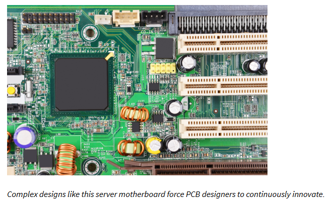

- If you look around your own home and think about the number of electronic devices you own, it's important to note that any of these devices could contain at least one circuit board. It's highly likely that, at any given moment, you're surrounded by a dozen or more circuit boards. PCBs are truly the backbone of modern electronics.

### 1.3 PCB Design Software
- At the center of PCB design is the use of specialized electronics CAD(ECAD) software. An entire industry has developed around ECAD tools for PCB design, as well as specialized electrical simulators that are used to evaluate designs before they are manufactured. There is also a host of manufacturing software that is used to prepare a design for fabrication and assembly using automated machinery, called computer aided manufacturing(CAM) software. In this course, we won't focus so much on using CAM software, although we will look at the steps needed to take a finished design and prepare it for manufacturing.
- If you look at printed circuit board design software, the view you see may not be the most intuitive. The view you get in ECAD software does not look very much like an actual circuit board you might pull out of your computer or smartphone. In fact, compared to something like a mechanical design, the circuit board you see in your ECAD software may look very strange.
- The image below shows an example of a circuit board layout in Altium Designer. This layout may not clearly resemble a real, assembled PCB you would find in an off-the-self product. One goal of this course is to teach you how to navigate one of these CAD drawings and identify various structures within the drawing.

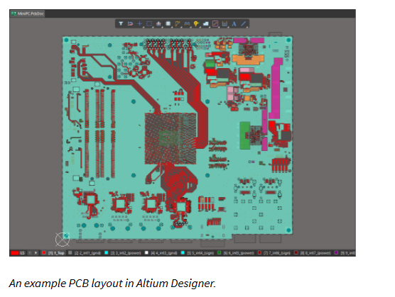

- While it may not be obvious, this circuit board is actually the motherboard for a small computer, and it is available as a sample project within Altium Designer. In this view, we're only looking at the features in the top-most layer of the board. This board is actually very complex, comprising multiple layers and components on both sides of the board. We'll return to this layout periodically to show some examples of common features found in PCBs.

### 1.4 Some Basic Terms to Help You Get Started in This Course
- There is some important terminology that is used to describe PCBs, and this terminology will be used throughout the course in various locations. All of the important terminology has been compiled into a course glossary(Check FurtherReadings.md), you should refer to this document periodically as you work through the course. Some of the important terms to help you get started and progress through the rest of this unit are listed here : 
    1. **Components** : This can refer to anything that can be soldered onto a PCB. Examples include resistors, capacitors, and integrated circuits. A component is also an object in a CAD program, and it may refer to a physical feature that is not soldered onto the board.
    2. **Printed Circuit Board(PCB or Circuit Board)** : Refer to the bare boarrd design without any of the assembled components.
    3. **PCB Layout** : A CAD drawing showing the location of all elements that will appear on an assembled PCB. This includes all components and copper that will appear on both sides of a PCB.
    4. **Trace** : A copper connection made between two components in a PCB layout. A trace is sometimes called a "track"
    5. **Layers** : All PCBs can have multiple layers, which will include copper connections and components. Internal layers only contain copper, which are only used to make electrical connections. There are two types of layers in any PCB : Plane layers and signal layers. A plane layer has a large, uninterrupted copper region that covers the entire layer. A signal layer only contains copper traces that connect the PCB components.
    6. **MultiLayer PCB** : This term refers to any circuit board that has more than two copper layers in total.
    7. **PCB stackup** : Also called a layer stack, this term refers to the arrangement of layers used to build a bare printed circuit board.
    8. **Schematic Sheets** : Drawings that show how components are connected to each other, similar to a circuit diagram.
    9. **PCB Fabrication** : Refers to the first half of the manufacturing process, where each layer of a bare PCB is fabricated and copper features are etched on the PCB.
    10. **PCB Assembly(PCBA)** : This term has two meanings. It is often used as a noun, referring to a fully assembled PCB. It also refers to the PCB assembly process, where components are soldered onto a bare PCB. In this course, we will normally write "PCBA" for the former, and "PCB assembly" for the latter.
    11. **PCB Laminate** : Also simply called a laminate, this refers to the insulating material used to separate copper layers and build a PCB stackup.
- Like many industries, the electronics industry has developed its own terminology, and you will be exposed to many important terms used by design professionals throughout this course. As the course progresses, new terminology will be introduced as it's needed, but these terms will come up repeatedly to refer to some of the important physical and electrical aspects of all PCBs.
- In the next section, we'll see how CAD tools are used to create PCBs. These software packages are highly specialized for use in creating a PCB layout and manufacturing files, and using CAD tools will be a major focus in this course.

## 2. The Role of CAD Tools

### 2.1 The Role of CAD Tools
- An important aspect of any engineering design course is learning to use CAD software, and PCB design is no different. PCB designers use specialized CAD tools to create the physical layout of a printed circuit board. When we say "physical layout", we're referring to the arrangement of components, pads, traces, vias, and any other component or physical element that will be placed on the PCB.
- Technically, you could use any CAD program to create a physical layout of a PCB. However, the industry has developed specialized software, called **ECAD** software, that helps automate many of the tasks involved in creating drawings of a physical layout. Altium Designer is one such program, but there are many others that use similar workflows and have similar tool sets for creating PCB layouts.
- The files you create in your ECAD software will store all the information needed to understand and manufacture a design. The PCB layout is most important because it is like a picture of the board that will be fabricated and assembled by a PCB manufacturer. However, a PCB layout is not the only document you'll work on in your CAD tools. It is also important to understand the primary set of files you'll need for a design. Different ECAD applications use different sets of files to store design information, but there are a few common file types that are used in every design.

#### 2.1.1 Common PCB Files
- When designing a PCB, there are four major types of documents you will need to create a design : 
    1. **Schematic Sheets** : Your schematic sheets are like the electrical blueprint for your design. These documents show components, nets, and other information needed to understand the design.
    2. **Bill of Materials** : This document is a list of all components used in the design. It will be used to order components and to aid assembly.
    3. **PCB Layout** : This document shows the physical placement of components and copper connections between them. The PCB layout document will also describe the layer stack used in the design.
    4. **PCB Libraries** : Your libraries store all of the CAD data for your components(Schematic Symbols, PCB Footprints, 3D models, and SPICE subcircuits). Libraries also store procurement information for each component, including MPN, distributor information, a description of each component, quantities of each component, and possible alternative components.
- There four types of documents are the minimum needed to create the physical design for your board, but they aren't the only documents used in PCB development. The design can't be prepared for fabrication until the PCB layout is finished. Once the layout is complete, there is another set of fabrication and assembly files that are used in PCB manufacturing processes. We'll cover manufacturing files in more detain in the next section.

### 2.2 Schematic Sheets
- All desings will start with schematic sheets. These files are drawings that show which components are used in the design, the nets used to make electrical connections between components, connections involving power and ground nets, net names, and other notes needed to understand how the design works. An example of a typical schematic sheet is shown below : 

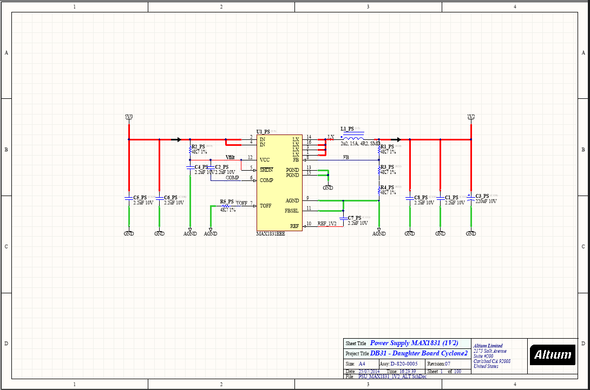

- A PCB design project could have several schematic sheets, all of which show the electrical information in your PCB layout. Schematics show several important pieces of information that are not contained in the PCB layout.

| **What's in schematic sheets**                                            | **What's not in schematic sheets**                                                |
|:-------------------------------------------------------------------------:|:---------------------------------------------------------------------------------:|
| All components that are used in the design                                | Physical location of components in a PCB layout                                   |
| Nets that make electrical connections between components                  | Whether nets are composed of traces, vias, planes or polygons                     |
| Any components like connectors that may be part of an interconnect        | Whether an interconnect passes through a plane layer, cable, or other element     |
| The power and ground connections on various components                    | Whether planes, traces, connectors, etc. are used to supply power to components   |
| Port connections used to defined nets that span between two sheets        | How copper is routed between ports to create a physical electrical connection     |

- To see how these different pieces of information are stored in a schematic, consider example shown below from the MiniPC example project in Altium Designer(Introduced briefly in Lesson 1). This example shows a portion of a schematic sheet with a USB bridge chip and two capacitor banks. We can see power nets connected to two capacitor banks(named IO_3V3 and IO_1V8), and these same power nets are connected to the USB bridge. We can also see that there is a ground connection on the capacitor banks and the USB bridge component.

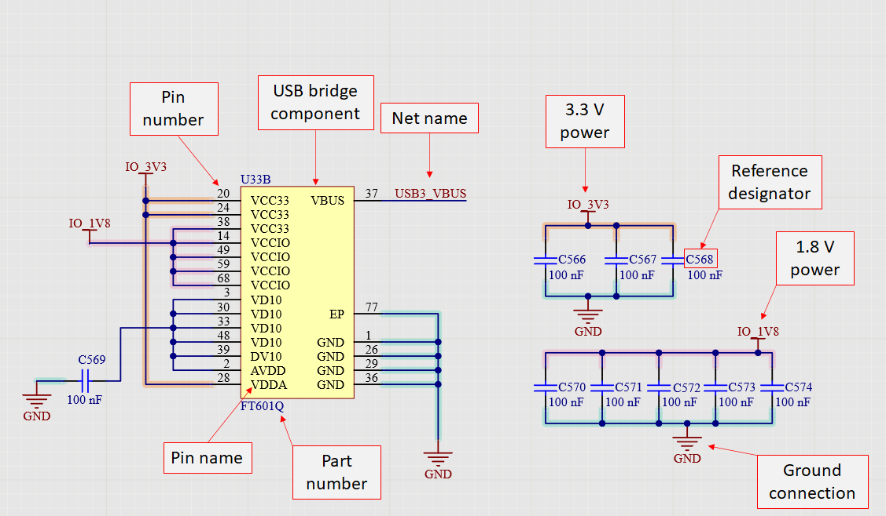

- Because we have the GND net connected to the USB bridge and both of the capacitor banks, we know that these three portions of the design will be connected in the PCB layout with copper. The schematic only shows us that these connections exist; it does not show how they are connected on the PCB. In the PCB layout, we could make this connection with a polygon, plane layer, or traces and vias. How you should make this connection requires some judgement and experience.
- There is another net in this schematic sheet named USB3_VBUS. This net connects to a different component in our schematics that is not shown here. It is common to use net names to indicate electrical connections rather than drawing a wire to represent the connection. This prevents unnecessary clutter in a schematic sheet, and this practice allows connections between different schematic sheets to be defined.

### 2.3 PCB Layout
- The PCB layout file contains the location of any physical element that will appear in the PCBA. The PCB layout file will also describe the stackup used to build the PCBA. Some ECAD applications will place the stackup in an external file, while Altium Designer encodes all of the PCB layout data in a single file. The stackup for a PCB can be viewed graphically in your ECAD software.
- The image below shows a portion of the stackup in the MiniPC project. This PCB contains 16 layers, so only a portion of the stackup is shown. From here, we can see the thickness of the core and prepreg layers, the copper weight used in each layer, and the dielectric constant for each laminate material in the PCB stackup. The MiniPC PCB has a total of 16 layers, so only a portion of the layer stack is shown blow.

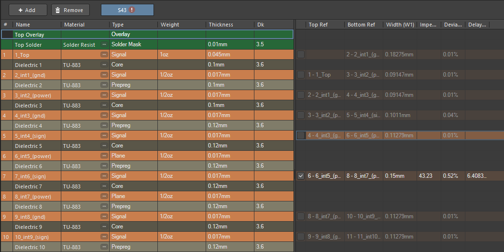

- Every component in a schematic has a corresponding footprint that appears in the PCB layout. You can spot the correspondence between these documents by looking at the reference designator. The image below shows the PCB footprint for the USB bridge component in the above schematic. Only the component outline, pad locations, and reference designators are shown for clarity.

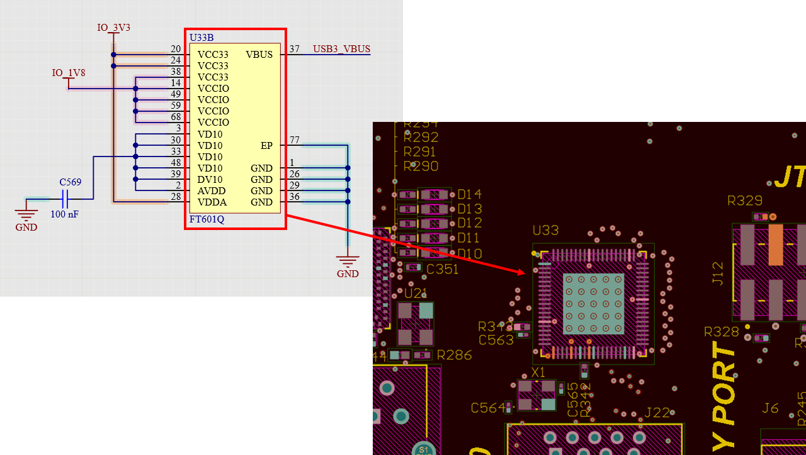

- It's very important to keep all of your design documents synchronized. As you work through a design, sometimes you may need to make a modification, like delete or add a new component, change a net name, update a reference designator, and some other tasks. Synchronization goes in both directions : If you make one of these changes in your schematics, you will then need to import that change into the PCB layout. Similarly, if a change to a design is made in the PCB layout, it will need to be imported back into the schematics. ECAD software has built-in features that help automate this synchronization.
- More advanced ECAD software will allow you to work with 3D models of your PCB so that you can see a realistic visulization of an assembled board. The image below shows a 3D view of the MiniPC PCB Built in Altium Designer.

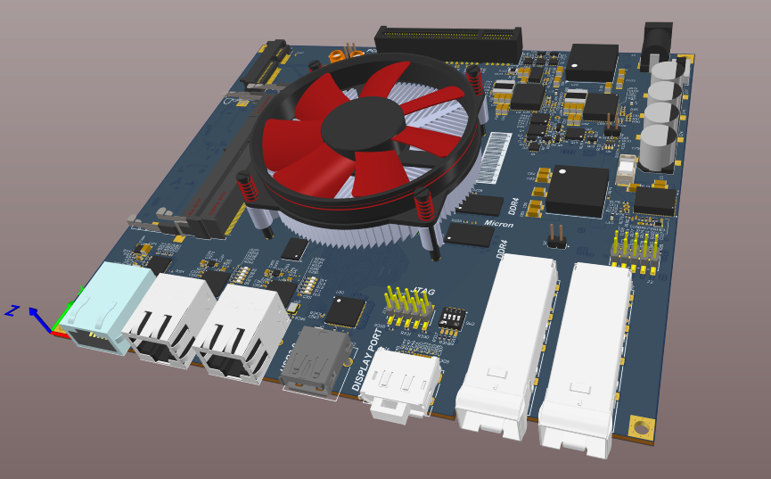

### 2.4 Bill Of Materials
- Typically, when starting a new design project, you will have a rough idea of the components needed in the design, or you will know which circuits you need to build into the design. As you select components and design your circuits, new components will be added to your bill of materials until you've completed the design. You won't have to add components to the bill of materials manually. As you add components to a design, ECAD software does an excellent job of adding the components to your bill of materials automatically.
- A bill of materials is normally exported from your ECAD software as a PDF file or as an Excel file. This file will contain a large table, with each row being an entry for different components in the design. The image below shows an the entry in the bill of materials for the USB bridge component shown earlier : 

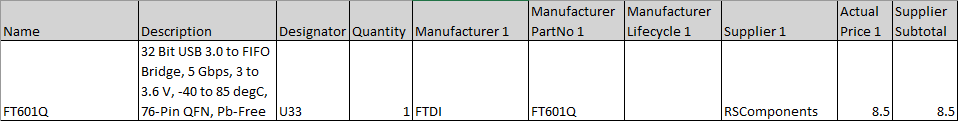

- Each unique component will have its own entry in the bill of materials. If a component is used multiple times, you will see multiple entries in the "Designator" column for that component. The value "U33" in the above entry is the reference designator for the USB bridge component. This tells you exactly which schematic symbol and PCB footprint corresponds to this component in your other design documents.

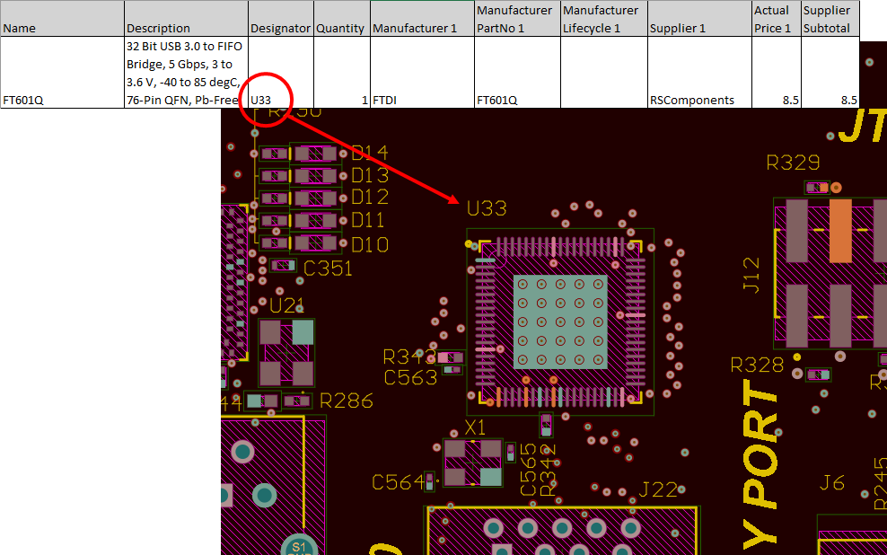

- Each entry in a bill of materials has a corresponding entry in the PCB layout.

### 2.5 PCB Libraries 
- Data that is common to the above three sets of documents is stored in your PCB libraries. Different ECAD applications have different formats and structures for their libraries, but all libraries will include the same set of required information. Your libraries are like the glue that holds all the other documents together and ensures your design data remains synchronized. Many times, a designer will need to build libraries from scratch, either by creating CAD data(symbols and PCB footprints), downloading data from manufacturers or vendors, or finding data from other designers online.

### 2.6 Summary
- CAD tools and the ECAD documents described in this section will become the major focus in upcoming sections of this curse, It's also very important to understand how these documents are used to generate manufacturing files. These files and their role in the PCB manufacturing process will be examined in the next section.

## 3. Your First PCB Project

### 3.1 Your First PCB Project
- Now that you've had a chance to get an introduction to the types of files used in PCB design software, it's time to create your first project and a schematic sheet for a new design. Before you can start creating schematics, you'll need to create a new PCB project that will hold all of your design files. Every ECAD software application has its own file structure it uses to create and store your design data.
- For this demonstration and in the rest of the course, we'll work in Altium Designer to create your new project and schematics. The steps outlined in Altium Designer are broadly applicable to other ECAD applications, which also use a project-style file structure to store design data.

#### 3.1.1 Video - I 
- Altium 365 allows to store projects in the cloud with all of the documents and components. To use Altium 365, first need to connect to a personal or organizational workspace.
- With Altium 365, you can create a workspace. When creating workspace, checking Include sample data field allows it to download example projects, components, various templates.

- Once you've created your Altium 365 Workspace, this will be the central repository for your projects. To get started using some of the basic features for storing and opening designs, please check ut the video below.

#### 3.1.2 Video - II
- Altium 365 allows to store components, projects and any documents on the cloud. 
- To access Altium 365, either can be accessed through web or locally. 
- You have personal and organizational workspaces. Personal is private. When to open a new project, we can either connect to cloud and open it or open it via local storage.
- Components are easy to use on cloud. Also stock information and alternative part numbers can be added.
- Supply Chain Data sources(Octopart, IHS Markit Source) can be used to research for supply chain actions.

- Altium Designer will be the main design tool you'll be using in this lesson and the rest of the course, although the steps outlined in the course are also applicable in many other PCB design applications. The interface in Altium Designer is very important and has many tools you'll use to view and manage the files in your PCB projects. Watch the video below to get a short introduction to the design environment in Altium Designer.

#### 3.1.3 Video - III 
- On top everything important is in those menus. In the left and right are panels. Panels can be docked.
- In file menu, can open project via Open new projects or Open Project or Recent Project button.
- Properties panel shows information about object selected on schematics. Also in PCB(Layout window) also provides information but its different from schematic.
- When you want to select object with specific properties, selection filter can be used.
- View configuration used to select for viewing Layers. 
- DXF file can be imported and showed as mechanical layer in Altium Designer.
- To see the signal layer when routing, Press <code>Shift + S</code>
- In PCB view if you hit <code>2</code> it will show in 2D mode, if you hit <code>3</code> it will show in 3D mode.

### 3.2 How to Create a New Project
- After you've installed Altium Designer on your computer, you're ready to create a new project. To create your new project, navigate to <code>File -> New</code> in the top menu bar, and select <code>"Project"</code>. From here, the <code>Create Project</code> window will open. In the Project Type protion of this window, select the <code>Empty</code> project(see the image below). Next, give your project a name and choose a location for the project on your local computer.

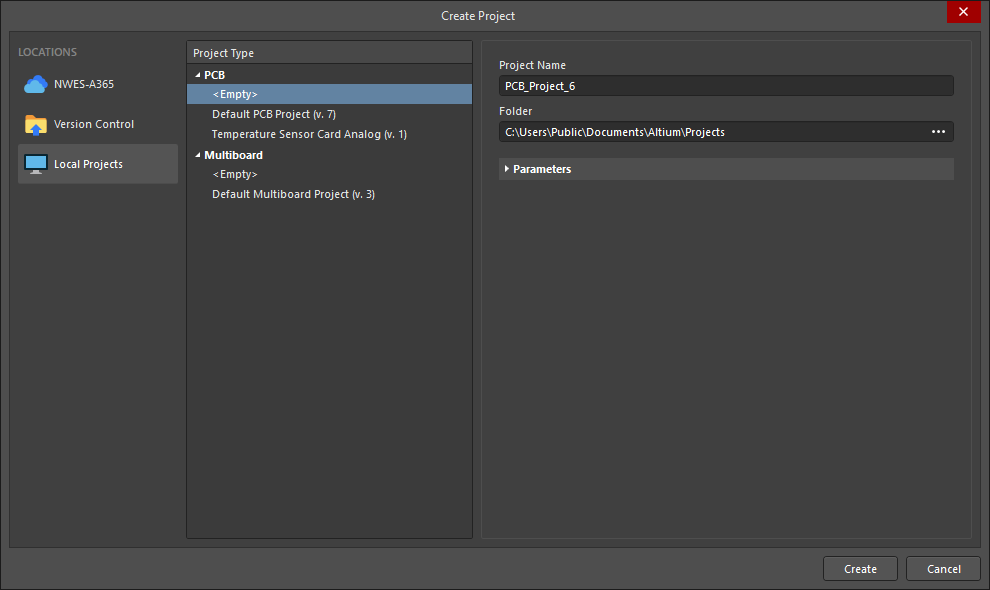

- Name your project DemoProject and click Create. Once you create the new project, it will appear in the Projects panel on the left side of the screen. As you add new files to the project, these will also appear in the Projects panel. As you go through this course and keep adding new files to your new project, you'll quickly pick up the file structure used in the Altium Designer.
- To add a new schematic to your project, right-click on the <code>DemoProject.PrjPcb</code> file entry in your Projects panel, and select <code>Add New to Project -> Schematic</code>. This will create a blank schematic that exists within your new project. Note that the actual schematic file will not exist in your project folder until you save the schematic file(Use the <code>Ctrl + S</code> shortcut key, or navigate to the Save command in the File menu).

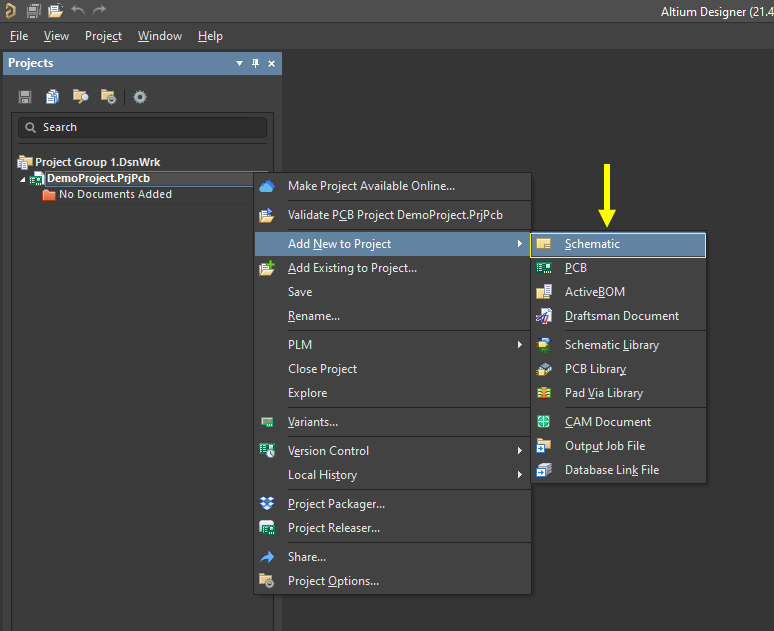

- Once you create the new schematic, you'll see a blank schematic open in the main window. From here, you're now ready to start adding components to your schematics and make connections. You can also continue adding as many schematic sheets as you need to build up circuits in your design with the above process. The <code>Add New to Project</code> command shown above will also be used later when it's time to add a PCB to your project, create output files, compile sourcing information, and other files you'll need to create a complete PCB project.

#### 3.2.1 Video - I 
- When adding schematics to project, we can use sheet templates. Select Schematic and goto properties and there is options to select schematic sheet options.

- Now that you have your blank schematic open, one task is to fill in the title block. Use the Place Text String option in the top toolbar, and click into the title block to start placing text. Once you've placed all the text strings in the title block, hit the Escape key on your keyboard to exit the tool. You can now go back and edit the text strings by double clicking on eeach string, or using the Properties panel.

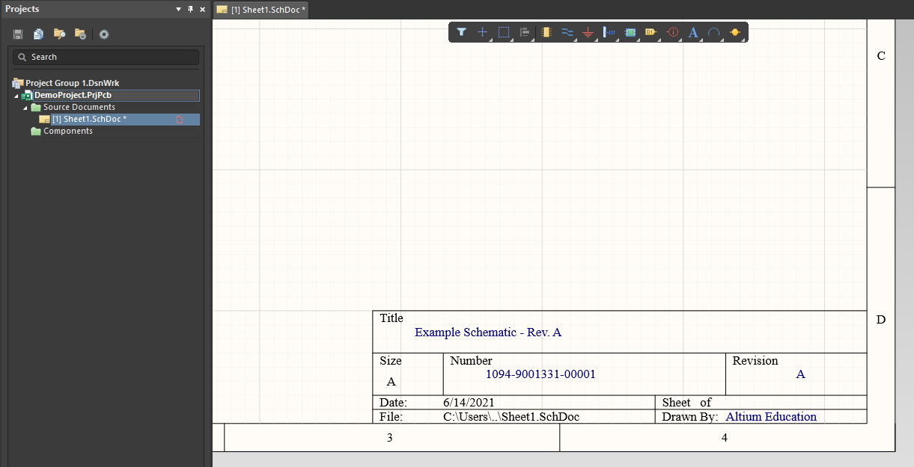

- Now that we've gotten this far, the next lesson will focus on the basic design tasks involved in creating schematics. You'll also see an example where we get to find real components and place them in the schematics. You'll have a chance to see some of the decisions professional designers have to make about which components gets added to a new design. You'll also get access to some simple tools you can use to find components for your board.

### 3.3 Make Your Project Shareable

#### 3.3.1 Make Your Project Shareable
- All Altium Designer users are able to make their projects shareable through the Altium 365 platform. Think of Altium 365 like Google Drive, but for PCB design projects. Altium Designer lets you access your own dedicated workspace to store and share your projects. You can also access your Altium 365 workspace using your login credentials through your web browser.
- To store your new project on Altium 365, right-click on your <code>.PrjPcb</code> entry in the Projects panel and select the <code>Make Available Online</code> option.

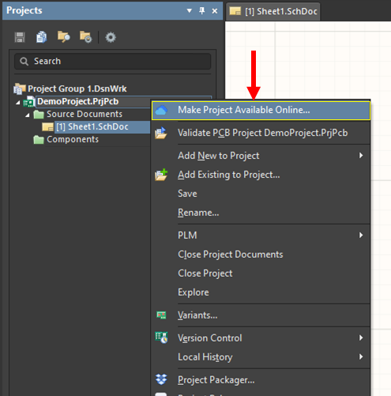

- After clicking on this option, you'll be taken to another dialog where you can add a comment to the project before adding it to Altium 365. Once you click through the next dialog, your project will be added to your Altium 365 Workspace and will be available for you to access in the cloud. You'll also be able to share your design with your classmates. We'll go over some of these features in the upcoming lessons.
