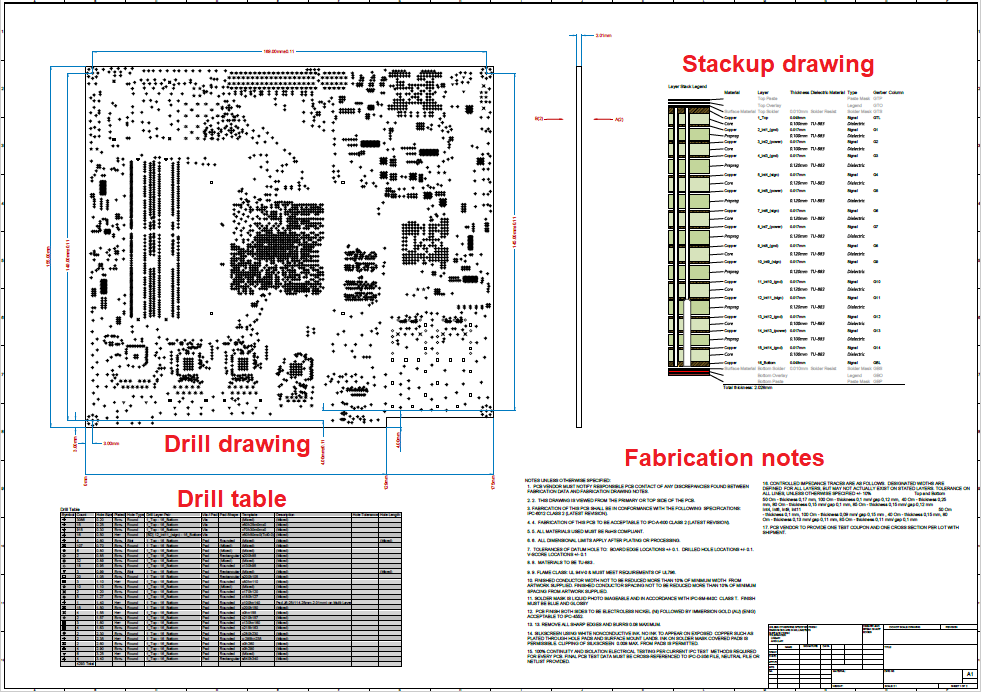
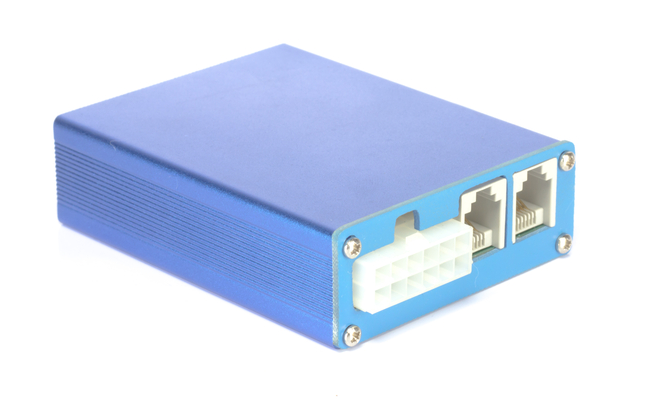
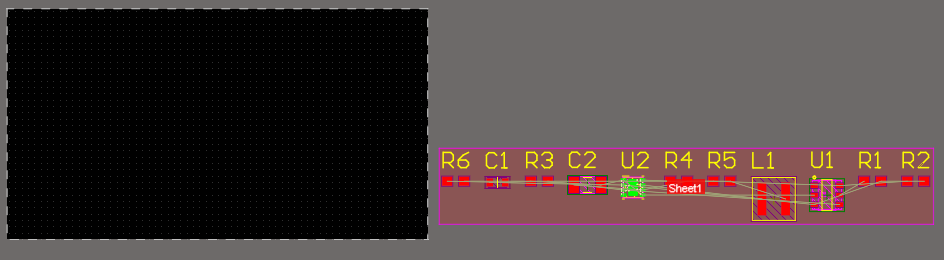

# UNIT III - PCB Layout

## 1. What is a Printed Circuit Board ?

### 1.1 What is a Printed Circuit Board ? 
- In a way, we answered the question **what is a printed circuit board?** in Unit I : A PCB is a product that mechanically supports electronic components and allows them to be connected together on the same surface. While this sentence is true, there is much more going on inside of a PCB than the components and copper connections you see on the surface.
- Before you can become a PCB designer, it is important to understand what goes on inside of a PCB. All PCBs have similar structures that are used to mount components and allow them to be connected electrically. The structure of modern PCBs did not happen by accident, it has slowly developed alongside PCB manufacturing capabilities and processes adopted by the electronics industry.
- PCBs need to be designed so that they can be easily fabricated and assembled, something that is sometimes more difficult than it shounds.
- Today, designers focus on a practice called **design for manufacturing** or DFM, the goal of which is to ensure a bare board is designed so that it can successfully pass through the PCB fabrication and PCB assembly processes. PCB design software is also developed with the goal of ensuring a designer can implement DFM practices in their PCB layout and so that the structure of a fabricated circuit board is consistent with the requirements of the PCB manufacturing process.

### 1.2 Anatomy of a PCB
- As we mentioned before, a PCB is made of multiple layers arranged in a PCB stackup. When creating a PCB layout, the first place the designer starts is with the layer stack. The layer stack needs to be designed first as its structure will affect many other aspects of the design. In particular, it will determine how easy it is to route copper connections in the PCB layout, as well as how closely components can be placed on the surface layers.


- This diagram shows the cross-section of an example PCB stackup
- This example layer stack includes a total of 8 layers(2 plane layers and 6 signal layers). Connections between different layers can be made with a structure called a via, which resembles a hollow pipe traversing the thickness of the PCB. It's up to the designer to choose how many layers they want to include in their PCB stackup, and there are a few methods that can be used to estimate the number of layers needed in the design. We'll discuss estimating the required layer count in more detail in a later section.

#### 1.2.1 Plane Layers
- The plane layers provide an important function in a printed circuit board : 
    1. **Power** : A plane layer is a good choice to use to provide power throughout the circuit board. This provides an easy way to for components to access power no matter where they are placed on the surface layer.
    2. **Ground** : Circuits often need to access ground in order to form a complete circuit. A grond layer beneath the components provides easy access to ground through a via. This way, you won't have traces all over the signal layers that only provide ground.

#### 1.2.2 Vias
- Connection between layers are made with vias. The simplest type of via is through-hole via, which spans across the entire PCB stackup. This allows the designer to make a connection between any set of layers by placing a trace that connects to the via. There are often types of vias that do not span the entire layer stack, called blind vias and buried vias. We'll discuss these other types of vias when we look at the PCB fabrication process.

#### 1.2.3 Rigid Laminate Materials
- Next, let's look at the internal slices along the depth of the PCB stackup. Most PCBs use rigid laminates to build the PCB stackup. Within a PCB stackup, there are multiple materials used to define layers place, place tracks, attach components, and protect the board against corrosion and damage. The most important parts of a layer are the laminate materials, which separate the plane/signal layers and provide support for components on the top/bottom layer. All laminate materials are electrically insulating materials made of a fiberglass material impregnated with an epoxy resin.

#### 1.2.4 Flexible Materials
- PCB stackups can also be built using flexible materials, although the layer counts tend to be much lower. Flexible circuit boards can be bent and flexed into odd shapes, so they are often used in very tight spaces. Some great examples are in computers for aircraft, your smartphone, and digital cameras.

#### 1.2.5 On the Surface Layer
- The surface layers will include several materials, including copper features and protective materials on top of the laminate and exposed copper. Note that most modern PCBs are double-sided, meaning the top and bottom sides of the board may have components. During fabrication, there are two materials applied to the top and bottom layers of a PCB.
    1. **Solder Mask** : The top layer of a PCB is called the **Solder Mask**. This layer is used to define the locations where solder will be applied for PCB assembly. The solder mask gives a PCB its characteristic green color, although the solder mask is available in almost any color.
    2. **Silkscreen** : If you look at the surface of a PCBA, you'll usually see some letters, numbers, or logos printed on the board. This material is called **silkscreen**
- The image below is a cross-sectional view showing the arrangement of these materials in the PCB stackup. Note that, in areas on the surface where there is no copper, the solder mask layer is bonded directly to the laminate.
- We'll look more at the important properties of these materials later in this unit and the next unit. For now, just know that there are many different laminate materials that designers can choose from, and the electronics industry has taken steps to ensure that many materials are compatible with each other.


- Components are also placed and soldered on the surface layers. Ther are two types of component used in every PCB.
    1. **Through-Hole** : If you've ever handled axial resistors or capacitors in an electronic lab, then you're familiar with through-hole components. These components solder into via holes on the surface layer, and these vias can connect to an internal layer if necessary.
    2. **Surface-Mount** : These components are sometimes called surface-mount devices(SMD) or surface-mount technology(SMT). Both terms are often used interchangeably when referring to components. These components attach directly to exposed copper pads on the PCB.


- The square and rectangular pads in this image are used as points to solder SMD components, while the large holes on the board can be used to hold through-hole components.
- You can spot through-hole and surface mount components just by looking at the leads on the component. The resistors, capacitors, and DIP chips used in most electronics lab classes are some examples of through-hole components. In contrast, SMD components do not have wired leads hanging off the components. Instead, they only have flat pads on the bottom side of the component. These pads are used as contacts to solder the component onto the surface layer of the board.

#### 1.2.6 Copper surface Plating
- Exposed copper on the top/bottom layers of the board will have an applied plating and surface finish. This process is used for two reasons. First, the plating provides a surface that can easily accept solder so that a strong solder joint is formed during PCB assembly. Second, the plating protects the copper from corrosion and damage. The plating materials used in a PCB include gold, tin, nickel, and silver. The industry has developed several processes to apply plating materials, and a designer will need to specify their desired plating material when preparing for manufacturing. Plating materials will be discussed in more detail when we look at PCB manufacturing.

## 2. The PCB Design an Manufacturing Process

### 2.1 The PCB Design and Manufacturing Process
- It may not be obvious from the previous section, but there is a specific design process that is generally followed when a PCB designer starts a new project. ECAD software was designed to support this process and help designers follow a series of steps to help get their designs into production. There is also the PCB manufacturing process to think of. Many designers will jump into their first design projects without thinking through the manufacturing process and how a PCB will be put into manufacturing. Just remember, there's no point in designing a new board for a real product if the PCB cannot be manufactured. 
- Because of the complexities of PCB design and manufacturing, the role of a PCB designer has changed over time. Today's PCB designers need to take an active role in multiple phases in the product development process, they aren't just creating CAD drawings of a PCB layout. For new designers, this requires learning many new skills, but it's also a very fun process of collaboration with a diverse group of engineers, as well as manufacturers. Just like the creativity you get to exercise in layout and routing, this collaboration can be very meaningful, especially when a design comes off the assembly line. 

### 2.2 The Role of a PCB Designer
- In the past, PCB designers were largely autonomous and they did not need to constantly interface with other members of a product development team. This isn't the case today. As electrical and mechanical designs have become more complex, so has the role of a PCB designer. If you're designing the PCB for a new product today, you'll be involved in multiple aspects of engineering.
    1. **Mechanical** : A PCBA needs to fit into its enclosure, so the designer needs to interface with the mechanical designer early so they can understand the mechanical constraints on their designs.
    2. **Electrical** : In the past, PCB designers would receive schematics from an engineer and only focus on the layer. Today, many designers also take a role in engineering and schematic design.
    3. **Drawing creation** : Once the design is completed, there are some standart drawings that should be prepared to aid fabrication, assembly and mechanical design.
    4. **Firmware** : Electrical designers who can code might also be tasked with writing firmware for a design. Some designers will need to write firmware for their boards and flash firmware into memroy.
    5. **Manufacturing** : The designer will need to prepare manufacturing files from the design data using some utilities in ECAD software. The designer should also inspect the files to ensure everything is correct.

### 2.3 Design Tasks Outside Your ECAD Software
- In this section, we won't discuss the first four points in the above list. We'll talk about all of this throughout the rest of the course. Instead, we need to look at some of the important design tasks you'll need to perform to ensure your design will be manufacturable. In addition to the standart tasks involved in using your ECAD software to generate your design files, there are other tasks you'll need to perform. Completing these tasks early will help reduce the time required to prepare the design for production when it's time to start a manufacturing run.

#### 2.3.1 Start Talking to Your Fabricator Early
- If you have a preferred fabricator, or you're producing a board on behalf of a fabricator, you should talk to them early to get some basic questions answered. These questions center around their capabilities. Many fabricators will publish a summary of their capabilities on their website, and you should review these to make sure you don't plan to violate their fabrication limits in your design.


- This is a portion of a fabrication capabilities statement from a PCB manufacturer. Manufacturers will tell you their fabrication capabilities, so make sure to check their website for a list.

#### 2.3.2 Get a Stackup Table
- One of the most common DFM problems that designers often ignore is the PCB stackup. Designers can't just choose to use any PCB laminate thickness they want to build a stackup. Core and prepreg layers come in specific thicknesses, and you need to combine these together to create stackup with the desired layer thickness and overall board thickness. This is a fun puzzle that requires matching available laöinates with your desired layer count and thicknesses.
- A PCB fabricator might publish their preferred stackups on their website, or you can email them and ask if they have a preferred stackup. They might send you an example stackup you can use for your design. An example stackup table for a 6-layer PCB is shown below : 


- Example PCB stackup table from a fabricator
- If you want to purpose your own stackup that doesn't match their standart stackup, you should send it to your fabricator to make sure they can produce it. Oftentimes, they will be able to substitute a compatible laminate material and thickness that can satisfy your design requirements. This might seem like a non-issue, but layer materials and thicknesses are very important when designing high-speed digital PCBs, so it's important to get it right as early as possible.

#### 2.3.3 Get Your Mechanical Requirements
- It's very often the case that the mechanical requirements in a design will dictate where components will be placed and how the PCB will be routed. PCB designers generally don't do the mechanical design for a product, but they will need to communicate closely with the mechanical designer to ensure they've placed components properly and they are within mechanical constraints. Once the PCBA is received from the manufacturer, it needs to fit into its enclosure; participating in the mechanical portion of the design early can help ensure this.


- PCB designers will need to participate in mechanical design to ensure a device can fit into an enclosure.

### 2.4 Preparing for Manufacturing
- Once a design is finished and has been thoroughly evaluated in your ECAD software, you can generate manufacturing files. There are several tasks that need to be completed before the board can be put into fabrication, and several fabrication files will need to be generated.

#### 2.4.1 Review Your Design
- Before a design is put into manufacturing, it needs to be reviewed by the design team and your manufacturer. The design team's review will be more thorough and focus on functional aspects of the design, whereas a manufacturer will review the design by checking against their fabrication/assembly capabilities.
- A designer should use this process to ensure a PCB meets all its requirements and will function as intended.
    1. **Design Rule Check** : Once the layout is complete, a final design rule check should be performed in your design software. This will catch any problems that the automated design rule engine did not catch while you were creating the PCB layout.
    2. **Functional Review** : The design team should review the board a final time to ensure it will perform its intended function. This is the last chance to change or adjust any of the features or connections in the design that will produce the required functions or user experience.
    3. **Supply Chain Review** : Once the design is completed, it's possible that some components are out of stock and may need to be replaced. These parts need to be identified and replaced before sending the design into manufacturing.
    4. **Mechanical Review** : The design should be checked to ensure it can fit into its enclosure. This also involves checking the locations of connectors to make sure they will peak through openings in the enclosure and can be accessed with cables. 
    5. **Application Review** : Many designs include a software or firmware application that needs to be reviewed before manufacturing. It's best for a hardware designer and the application developer to work together to ensure that the software/firmware works as intended and resolve any bugs before manufacturing.
- Altium Designer and other ECAD software application will include a design rule check tool that generates a rule violation report. As a designer, you should use this report as a final check in the above process to make sure your are complying with fabrication capabilities.
- To create a design rule check report, you will need to manually run a design rules check from inside the PCB editor. To do this, select the <code>Tools -> Design Rules Check</code> command in the top menu bar. Follow the steps to run a manual design rules check show in the image below. When the tool is finished, it will automatically create a report that shows any violations.


#### 2.4.2 Manufacturing File Generation
- After a thorough review of the design, it's time to create PCB manufacturing files. A designer will be responsible for preparing a design for manufacturing, and for communicating with a manufacturer to ensure the fabrication and assembly teams understand the intent of the design. There are several design files that are needed : 
    1. **Gerber Files** : These files show where copper, solder mask, silkscreen and solder paste are applied to the board during fabrication and assembly. These files are used to create stencils for fabrication.
    2. **PCB Panel Drawing** : A PCB panel is usually created by the fabricator, although sometimes they provide templates that the designer can use to create a panel. This drawing shows how the individual boards will be laid out the panel and where they can be broken apart from each other.
    3. **Drill File** : This file lists the coordinates and hole sizes for all drill holes that will appear on the PCB.
    4. **Pick-and-Place File** : this file lists the coordinates for all components on the board so that they can be automatically placed during assembly.
    5. **Fabrication and Assembly Drawings** : These drawings show the location of components, drill hits, and layer order in the PCB stackup.
- For now, just note that there are many files that need to be created beyond just the standart design files described in earlier lessons. Design files are used by PCB designers to create their projects and work within their design software, but manufacturers will use the above list of files to fabricate and assemble your circuit board. You'll have an opportunity to generate these files in Altium Designer as you work through this course.



#### 2.4.3 Manufacturer's DFM Review
- Once the fabrication and assembly files are sent into your manufacturer, they will perform their own review using your fabrication files. The review your manufacturer performs focuses on ensuring the board can be reliably produced as you've indicated in your fabrication and assembly files.

#### 2.4.4 Order Your Components
- Manufacturers and assemblers don't always purchase your components for  you. Some companies offer a turnkey service, meaning they will handle all the component ordering and logistics for a fee. Typically, you will need to contact distributors yourself and have components shipped to the assembly facility.
- There are several website you can use to help speed up the component purchasing and shipping process. One of these is Octopart; they compile component information, inventory, and prices from multiple distributors into a free search engine. Just type in your MPN and you'll be able to see available component stocks and distributor data.


- Example search results from Octopart for part number ISL28006FHADJZ-T7
- It may sound obvious, but your manufacturer can't being PCB assembly until they receive your parts. Therefore, it's best to order parts as soon as you've put the bare board into fabrication. PCB fabrication can take anywhere from a few days to a few weeks, so you'll have some time to source the components you need for your design and have them shipped to your assembler. 
- Once a PCB passes your final inspections, files have been generated, and parts have been ordered for the design, it's time to send the board into fabrication and assembly. The manufacturer you're working with will review your manufacturing data for any errors or missing data, andd they may send you a report that details any required changes. We'll examine the various components in the PCB manufacturing files and a manufacturer's DFM review in Unit 5.
- Once the board passes its DFM review and all parts have been received, the design will be put into manufacturing. Watch the video below to learn more about the PCB manufacturing process and to get a tour of a real manufacturing facility.

#### 2.4.5 Video - I 
- Rigid-Flex can be used for high quality PCBs.
- Würth Electronics uses direct imaging with lasers.

#### 2.4.6 The Waiting Game
- If you've gotten your board into production and assembly, then congratulations! Placing anything into manufacturing, whether it's a single prototype or thousands of units, is a difficult task. Waiting for your finished boards can be a nerve wracking and simultaneously exciting experience. Once you receive your finished boards and they work as designed, you'll be ready to test them and incorporate some lessons learned into future designs.

## 3. The PCB Design Workflow

### 3.1 The PCB Design Workflow
- The previous unit looked at a portion of electronics desgin that is sometimes called **front-end engineering**. In this phase of design and product development, the schematics that get developed are like the foundational blueprint for a new system. Once it's time to start creating a PCB layout, there is a specific workflow the industry follows to make sure designs fit into an enclosure and will satisfy mechanical requirements. If you decide to pursue PCB design as a career, you'll likely need to follow the standart workflow as this will be implemented by your team members.

#### 3.1.1 PCB Design Starts With the Enclosure
- The PCB design and layout process starts once an initial set of schematics is created, and the schematics are ready to be transferred into a new design. Once the bare board is being created in your ECAD software, it should be designed so that the assembled board will fit and mount into its enclosure. Professional design teams start designing a PCB by considering the enclosure and how this constrains the allowed space in the physical layout.
- The example enclosure shown below includes connectors at the edge and accessible through the wall of the enclosure. This is a typical configuration for connectors to interface with external devices. The connectors, the thickness of the enclosure, and the lateral dimensions of the enclosure will determine the allowed board size, the placement of some components, and the size of the components that can be included.



- The desired locations of connectors and dimensions of the enclosure will place important limitations on a PCB layout.
- We can look at the MiniPC project as a guide to get a sense of the mechanical requirements imposed when the board was originally designed. The connector placement, mounting and expansion card requirements are called out in the image below. All connectors for interfacing with external devices are placed along the bottom edge, while expansion card slots are located at other edges to make room for other groups of components.


- This grouping of connectors in different areas of the board is exactly what we expect to see when mechanical constraints are driving the design process. The rest of the elements in the board may have mechanical constraints that are defined early in the design process by mechanical designers, rather than being set by the PCB designer. The remaining room in the board is allocated so that the PCB layout engineer can carefully arrange components and route them within the allowed space.
- Because the enclosure constrains where you can place components, and the physical size of many components, PCB design teams will implement the following design workflow when creating a new product :
    1. Schematic design and mechanical design are performed before PCB layout, oftentimes in parallel.
    2. Any constraints on component placement, component sizes, board size, and mounting hole location are determined.
    3. The designer implements the required board shape and mounting style in the new layout.
    4. Components are arranged and checked against the size/height limits imposed by the enclosure.
    5. After replacing or moving any components, the design is routed and the layout and evaluated.
- The back and forth process is standart in design teams at smallar companies, and at large enterprises. PCB designers need to know a bit about mechanical design and MCAD software to ensure they can properly communicate with their team members.

### 3.2 What About Solo Designers?
- If you find electronics design interesting, but you don't want to pursue it as a career, you still might want to work on your own designs with a PCB design application. When you're working by yourself, you're free to implement any process you want. Try to find out what works best for you. When working on solo projects, most designers go back and forth between mechanical and electrical design and fine-tune both sets of design data until everything is perfect.
- If you're not a mechanical designer, or you don't have the resources to send a custom enclosure out for fabrication, there are some resources available to create an enclosure for your design.
    1. **Pre-formed Enclosures** : You can purchase small plastic or metal enclosures online for relatively low cost(as low as a few dollars). These may have ports in them for placing power or interface connectors, and some will have a vent if airflow is needed.
    2. **3D Printing** : If you need a small enclosure and off-the-shelf pre-formed enclosures won't work for your design, you can use a desktop FDM 3D printer. These 3D printers can be used to print just about any custom plastic enclosure you can imagine. Professional designers also use these 3D printers to create custom enclosures for prototypes.
    3. **No Enclosure** : Although not recommended for every PCB, you could opt for no enclosure at all. This is not recommended if you're designing anything that uses high voltage, high current, or that needs some level of environmental protection. For simpler designs, it's sometimes okay to just skip the enclosure if the board won't be put into a production environment.


- Small plastic cases like the model pictured above can be used as a basic enclosure for a PCB.
- These enclosures also have a defined mounting hole pattern, possibly with standoffs built into the enclosure. These points will also limit the space available for components and connectors. In this type of enclosure, it's common to drill a hole and use a rubber bushing for connectors so that a design can receive power and interact with external devices.

### 3.3 Next in This Unit
- In the rest of this unit, we'll focus more on how to use a PCB Editor and some useful features in ECAD programs that can help you find your way around a PCB layout. At the end of the unit, you'll have a chance to layout your DemoProject board and prepare it for routing. As you start the PCB layout for this project, you'll have a defined board shape and mounting hole location you'll need to target to give you an introduction to the standart workflow used by PCB design teams.

## 4. Navigating a PCB Layout

### 4.1 Navigating a PCB Layout
- Any PCB layout you look at on your computer screen can be rather complicated. You have components, electrical connections, planes and polygons, and mechanical elements to place and navigate in a PCB layout, and it can get confusing. Your CAD tools can help ease the process of moving around a PCB layout and tracking connections throughout the board.
- In this section, we want to look at some strategies for navigating a complex board, and some of the basic features you can use in Altium Designer to help you use the PCB Editor effectively. When you have your PCB layout open, some simple strategies for viewing and selecting layers and components will help you work faster on complex layouts, and it will be easier to track signals around the board.

#### 4.1.1 NAving a PCB Layout
- To show some examples of how to navigate your PCB layout, we'll look at the MiniPC board as an examplee. As you're likely aware, this board is rather complex, with multiple signal, power, and ground layers. 
- Once you open the board in the PCB editor, moving around the board might seem difficult. To help you get started, there are two basic tools you'll use to navigate the layout : 
    1. **Dragging** : Hold down the right-click mouse button and drag the cursor around the screen. This will move the layout view in the PCB Editor window.
    2. **Zoom** : If you have a mouse with a scroll wheel, you can scroll up or down to zoom in or out in the PCB layout. You could also use the <code>PageUp</code> or <code>PageDown</code> keys on your keyboard. If you're working on a lapto and you have a touch pad, you can use the squeeze motion on the touchpad to zoom.
- Try playing with these features so that you get comfortable moving around the PCB layout. Once you're confident in your ability to zoom into specific features in the layout, we can look at some of the simple viewing features that will help you navigate the board. 

### 4.2 Switching and Viewing Layers 
- Oftentimes, the easiest way to see what's happening in a PCB layout is to turn on a specific layer in your PCB layout. When we say **turn on** or **turn off** a layer, we mean to make it visible or invisible. By default, when you open up a PCB layout, all the layers will be enabled. You can then turn layers on and off in your layout so that the view you need is easier to track.
- Inside Altium Designer, this is done with the <code>View Configuration</code> panel. At the top of the panel, you'll see a <code>Layers and Colors</code> tab, which will list all the available layers in the PCB layout. During the layout phase, the most important layers are those in the Signal and Plane Layers group. You can turn on and off individual layers in each group by clicking the eyeball icon next to the layer name. Enabled layers will appear along the bottom of the screen.


- To set the **active layer**, click on one of the layers along the bottom bar. For the moment, we'll concentrate only on the signal and plane layers; these will always appear first along the bottom bar. 

### 4.3 Single-Layer Selection
- When you look at a PCB layout, you'll see all enabled layers visible by default. You can set only the active layer you want as being visible with the <code>Shift + S</code> key. This will partially or fully hide the other layers in your layout. This is very useful when used with the layer switch shortcut; when you scan through the layers with the <code>* or Shift + *</code> shortcuts, only a single layer will be visible at a time.
- In the image below, single-layer mode is being toggled with the <code>Shift + S</code> key while Layer 12 is active. As the background layers get turned off, they turn grey in the first single-layer mode, and then they dissapear completely in the second single-layer mode. When the second mode is entered, the information on other layers will totaly disappear and leave behind a black background. Note that you'll still be able to see vias, holes, polygons, and other objects.


### 4.4 Scanning Through Layers
- One way to quickly move through enabled layers is to use the <code>* or Shift + *</code> shortcut keys; just use one of these shortcuts to toggle the active layer in the layout. **These keys will only cycle through different signal layers**; plane layers, mechanical layers, and component layers will not become active when using these shortcut keys. These shortcuts will also only cycle through the layers that are enabled in the view configuration panel.


### 4.5 Mechanical and Component Layers
- There are two other layer groups in the View Configuration tab. The other layers available in these groups are : 
    1. **Mechanical Layers** : These sotre 2D projections of 3D models for components, allowing you to see component outlines that span beyond the limits of component pads.
    2. **Board Outline Layer** : This layer shows the routing path that will be used to cut out the board during manufacturing.
    3. **Overlay Layers** : The top and bottom overlay layers store the silkscreen for components. You may remember that some silkscreen features were defined when you create components. However, you can also add custom silkscreen as text if needed in your design.
    4. **Assembly Layers** : This set of layers is used to define paste mask and solder mask apertures in your PCB layout. You might need to modify information on these layers after you finish your PCB layout.
- The image below shows the layers associated with component U32, located just above the central FPGA on the top layer. As we scan through these other layers, we can assembly and silkscreen information associated with this component.


- One useful tool to help you customize the view in your layout is to set transparency on certain objects in different layers. For example, you might be in a view where you need to track a trace around a board, but some polygon pour is making it difficult to see. You can set the transparency for specific objects in the <code>View Configuration Panel</code> on the <code>View Options</code> tab.

#### 4.5.1 Video - I 
- To set transparency levels for layers go to <code>View Configuration -> View Options</code> tab. Transparency settings can be altered here or clicking <code>Advanced</code> button for more advanced setting configuration.

### 4.6 Tracking Nets in a PCB Layout
- Sometimes, tracing a net around a board can be difficult. Some traces can navigate around components, through multiple vias, and into multiple layers. This can also be difficult because : 
    1. You might know the name of the net, and you need to see everywhere it travels in the PCB layout.
    2. Other times, you're looking at a specific trace, and you want to make sure you can track where it leads in the physical layout, but you might now know the net name.
- Most PCB layout programs offer some net filtering or net highlighting tools to help you view and high track nets in your layout. When used together with single-layer mode and layer scanning, you can easily track a net around a PCB layout and see where the net ends in the board.
- When you zoom into a pin on a component or a trace on the board, you may see the name of the net overlaid on the object if you zoom in close enough. In the example below, we're zooming into the pins on the FPGA in the center of the board. These pin names are shown directly on the circular pads in the PCB footprint. The net name is shown just slightly off-center from the mounting pad along the small connecting trace.


- If you zoom in close enough, you'll be able to see pin names and net names on different objects in the PCB layout.
- Another way to see the net name for a trace is to hover your cursor over the trace and look in the box at the top-left corner of the screen. This box will show you the net name and will show you the net name, layer name, cursor location. Pay attention to this box as design rule violations will also be flagged here.


#### 4.6.1 Net Highlighting
- One way to see the full extent of the connections made by a trace on multiple layers is to hover over a trace, pad, polygon, via or other object, and hold down the <code>Shift</code> key. While the <code>Shift</code> key is depressed, every object that is part of the net will appear with a white outline. The example below shows net highlighting on a blue trace on Layer 16 connected to the two DDR4 memory modules(components U14 and U15) in the MiniPC layout.


- From the box in the upper left, we can quickly see the name of the highlighted net and any connections it makes : 
    1. **VREFDDR4** : This is the name of the highlighted net.
    2. **GND** : The VREFDDR4 net makes a connection to the GND net somewhere along the highlighted trace.
- If we want, we can zoom into the highlighted net and inspect it further to find exactly where the connection with GND occurs. Note that the lighter blue region around the highlighted trace is **GND**, but there is no direct connection between **VREFDDR4** and **GND**. Where does this connection between these nets arise?
- As it turns out, this occurs through a component. If you zoom into the trace near the lower portion of the net, you'll see where two pads are placed along the **VREFDDR4** net, and one of the pads is connected to the **GND** polygon(see below). As it turns out, this is a capacitor, which is being used in the layout to help ensure **VREFDDR4** supplies a stable DC voltage to certain pins on the **DDR4 RAM** modules.


- Remember that planes and polygons can be part of a net, but it isn't always obvious by looking at a single layer in the PCB layout. In the image below, we've used the net highlight feature to highlight a net and its connected polygons on an internal layer. In this image, a pad on Layer 1 was used for highlighting, but we can see that this pad is also connected to polygons on internal layers. These polygons will get outlined as you highlight the net, and if you scan through the enabled layers, you'll find that these polygons are on Layer 3.


- Whenever you are working in the PCB layout, and you need to check specific connections or nets, these highlighting features can be a big help. When you need to investigate some components, polygons, vias, or other objects connected to a net, you need to be able to select these objects and examine them.

### 4.7 Selecting Objects
- While a task like **selecting objects** sounds simple, it can be difficult to select a specific object in a complex layout like the MiniPC board. This is because many objects in the PCB can overlap, and it's possible to select multiples of these objects when you didn't intend. For example, some of the components sit on top of polygons, and they have trace routing with vias beneath them. How can you select only a copper feature or only a component in the layout? 
- In order to choose which objects will be selected as you navigate a PCB layout, you'll need to use the selection filter. This feature can be found in the <code>Properties Panel</code>


- There are other useful options in here as well, which will give users the ability to easily move and place components. We'll make use of these at the end of this unit and in the next unit on routing. 
- The selection filter is one of the most important features that helps ensure you only select and modify specific types of objects in the PCB layout. The selection filter is best used in single layer mode after you've located a specific object you need to select on a specific layer. To make best use of this feature, switch to single layer mode to hide objects on other layers, then turn on the selection filter you need. To use the selection filter, simply toggle on the boxes for the object types you want to select.


- Once the object type is turned on, you can click on an object in your PCB layout, and it will be selected if it matches the object type in the selection filter(see above). This is very useful for helping users navigate a complex layout with dense object placement. Whenever you need to deselect an object, you can <code>Shift + Click</code> on selected object, or you can click on blank space(the grey background in the PCB) to deselect everything.

#### 4.7.1 More Advanced Selection Features
- The tools shown above are a great way to move around your PCB layout, track connections, and select objects in the layout. However, there are times where you may not be able to track down a specific object in your PCB layout, although you might know the reference designator. There are additional filtering and selection features you can use in the PCB Panel. In this panel, you can select specific components, polygons, groups of nets, and other objects in the PCB, and you can automatically zoom into these features. The video below gives a brief overveiw of how to do this in Altium Designer.

#### 4.7.2 Video - I 
- <code>PCB Panel</code> will help you narrow down componets, nets in your project for selection. 
- If you want to unselect everything, press <code>Shift + C</code>.

### 4.8 Summary
- So far, we introduced a lot of features that help you navigate your way through a PCB layout in Altium Designer. Other ECAD programs might offer similar features, and just like Altium Designer, mastering these features takes practice. Be sure to review the animations and videos above to see the best way to use these features as you work through a PCB layout. In the next lesson, we'll look at how to select materials any layer arrangements in a circuit board stackup.

## 5. Stackup Design 

### 5.1 Stackup Design
- We're almost to the point where you can start arranging components in your PCB layout. However, before you do this, there is an important task we need to complete : Designing the PCB layer stack. You might have noticed that, in the previous lessons, we've made a big deal about stackup design. The arrangement of signal and plane layers in your PCB stackup will determine how electrical signals travel in your board, as well as the stability of DC power in your board, so it's important to make sure this step is completed before you place components and start routing. 
- ECAD software applications will include a tool that allows you to set your power, ground, and signal layers in your PCB stackup. You'll have the option to designate certain layers as planes or signals, and you can select materials for your PCB stackup.

#### 5.1.1 Function of Different Layers
- To get started designing your layer stack, you'll use the **Layer Stack Manager** in Altium Designer. You can access this tool by first opening your PCB file, and then select the <code>Design -> Layer Stack Manager</code> option from the top menu. Once you're inside the **Layer Stack Manager**, there are several commands you can use to configure the layers in your board. Some of the tasks you'll need to complete include : 
    1. Set plane and signal layers
    2. Specify core and prepreg layers
    3. Define via transitions
    4. Calculate impedance
    5. Specify material constants
    6. Select copper weight on each layer
- The following video shows how to perform these tasks in the **Layer Stack Manager** in Altium Designer.

### 5.1.2 Video - I
- In <code>Layer Stack Manager -> Properties</code> make sure Stack Symmetry is checked.

### 5.2 A Modern PCB Layer Stackup and Materials
- So far, we've focused a lot on the copper in your PCB, but just as important are the insulating dielectric materials in your layer stackup. We explored the different types of PCB laminate materials and some alternative materials options in Unit I, but here we want to look at some of the factors that should be considered when selecting laminates.

#### 5.2.1 Multi-Layer PCB Stackups
- Most PCB layer stackups will have 4 layers as an entry-level option, although advanced designs could have as many as 32 layers or more. The typical 4-layer PCB stackups is shown below. This stackup uses two plane layers to supply the required power, and two signal layers(defined on the surface layers) that are used for routing components.


- In this image, the current layer in this layout is a ground plane layer. The overlaid green tint spans the entire layer, which is your cue you're looking at a plane layer.
- There are a few things to notice about this PCB stackup : 
    1. It has alternating core and prepreg layers
    2. The stackup is symmetric about the central layer
    3. It has an even number of copper layers
    4. It has a total thickness of about 1.57mm(62 mils)
- These are standart points that are implemented in most PCB layer stacks. Your job as a designer is to choose the layer thickness, prepreg and core material arrangement, and materials to meet your dielectric constant target. 

#### 5.2.2 Core vs Prepreg
- The central layer of dielectric PCB laminate material is called a **core**, which is a rigid laminate material that is coated with copper on each side. The surrounding layers called **prepreg**, which are like filler layers. In more complex stackups with higher layer count, the prepreg layers are like the glue used to bond multiple core layers together in the PCB stackup. As an example, take another look at the MiniPC PCB stackup; the core and prepreg layers are alternating throughout the stackup.


- This image shows the first 8 layers in the MiniPC PCB stackup. This PCB stackup is designed so that the core and prepreg layers are alternating. The prepreg material acts like an adhesive to bond two core layers together.
- Depending on the manufacturer, the core and prepreg layers will have different material properties that should be considered when selecting materials. When you're selecting materials for your PCB stackup, the manufacturer of your laminates will have several options with different material properties, and they will label the materials as prepreg or core in their datasheets. Keep this in mind when selecting materials.

### 5.3 Types of Layers in a PCB Stackup

#### 5.3.1 Plane Layers
- Plane layers are layers that are entirely filled with copper. Vias might pass through a plane layer to carry signals or power/ground connections, but generally they are intended to contain as much copper as possible to provide a complete, nearly uniform layer of conductor.
- To see some best practices for arranging your layers, we'll start with plane layers as these are often used for power distribution. Not all PCBs will need plane layers. In some cases, you might need to use a large region of copper instead of spanning an entire layer with a plane. When you look at a plane layer in a PCB layout in Altium Designer, it might not be obvious that this is what you're seeing. The plane layer will appear as a colored tint overlaid on the components and other objects in the PCB(see below).


- In this image, the visible layer in the MiniPC layout is a ground plane layer on Layer 6. The overlaid green tint spans the entire layer, which is your cue you're looking at a plane layer. 
- There are two types of plane layers used in PCB design : power and ground. Inside the **Layer Stack Manager** in Altium Designer, you don't directly designate plane layers as ground or power. You simply define these as plane layers in the stackup, then later you'll define each plane layer as either power or ground. Just remember, the settings in a layer stack tool in your ECAD is **plane** or **signal**; we'll show how to assign a plane to a net when we look at routing.
- Finally, you don't have to designate a layer as a plane layer in order to uste it for only ground or only for power. Why would we want to do this? We normally do this if we want to use polygon pour on a layer for ground or power. The shape of the region you need to define might contain some cutout, or you might want to put multiple **GND/PWR** nets on the same layer. The easiest way to do this is to just define the layer as a signal layer and draw out your polygons. We'll also look at this in the next unit when we discuss routing.

#### 5.3.2 Plane Naming and Layer Type 
- When you're designing your layer stackup, you'll want to give your layers names so that you can keep track of them in your PCB layout. There is a typical convention used to name PCB layers in most designs : 
    1. **GND** : Ground layer, sometimes named **AGND**(Analog Ground Layer) or **DGND**(Digital Ground Layer).
    2. **PWR** : Power layer, sometimes written with a prefix to define a specific power level.
    3. **SIG** : Signal layer, sometimes numbered in succession(SIG_1, SIG_2, etc..)
- You can use any names you like to label the layers in your design. The naming convention you use should communicate the function of the layer, similar to what's shown below. This makes it a lot easier to navigate your PCB layout, and for fabricators to better understand the function of each layer.


- Since we're using a multilayer PCB, we need to define allowed transitions between each layer. Set a through-hole via transition so that you can contact every layer in the board. Finally, if you haven't set a board size yet, now is the time to do so. Once this last point is finished, we can start placing components.
- To define via transitions, these need to be selected when creating the PCB stackup. The type of vias being placed and which layers they will touch can be selected in the **Layer Stack Manager** inside Altium Designer. The video below explains these via types and how to place them in the PCB stackup.

#### 5.3.3 Video - I 
- Vias used to transition between different vias.
- There are 3 types of vias : 
    1. **Through Hole Via** : Goes from top layer all the way to bottom layer.
    2. **Blind Via** : Goes from either top or bottom to inside layers
    3. **Buried Vias** : Its via between layers. No bottom or top layer involved.
- Also there is special types of vias : **uVia** (Micro Via) : Used in high-density boards. 
- If you are going to use Through Hole via only, dont need to define it on Layer Stack Manager. But if you are going to use vias other types, you need to define them on Layer Stack Manager.

- One last point to remember is this : just because you name a plane layer **GND** or something similar doesn't mean that it's automatically connected to a GND net. You'll have to do this inside the PCB Editor during routing. We'll look at how to do this in the next unit.

#### 5.3.4 Ground Plane Layer
- A ground plane layer, or simply a ground plane, is just like its name suggests : it acts like a ground connection for your circuits and components, meaning it sits at 0V reference in the PCB. It provides other benefits as well, and the presence of at least one ground plane is required in many designs.
- Some of the reasons a ground plane is used include : 
    1. It provides shielding against external noise originating from radio frequency sources
    2. It provides a path for heat transport away from hot components
    3. When used with an adjacent power plane, the pair of planes will act like a big capacitor that helps ensure stable DC voltage.
    4. It ensures the inductance in your interconnects will be low enough that the design will not generate or receive excessive EMI.
    5. It helps ensure the impedance you calculate for your traces is the same everywhere in your board
- The last point is probably the most important as it is critical for routing common computer interfaces(e.g. USB, HDMI, Ethernet, etc..). When working with these high speed digital protocols, or with high frequency signals used in wireless systems, a ground plane is required to ensure signal integrity during routing. We'll discuss this more in a later unit; just know that you will need to include at least one dedicated ground plane when using these protocols.

#### 5.3.5 Power Plane Layer
- Power layers are intended to provide DC or AC power to components in your board. A power plane can be connected to a positive or negative voltage output from your power supply, depending on the needs of your design. Power planes are normally used with a ground plane on an adjacent layer so that they can provide stable power by acting like a big capacitor.
- One common practice is to split a power plane into different sections, which can supply different voltages to different parts of the PCB. If you plan to do this with your power polygons, then you need to define that layer as a signal layer in your PCB stackup. An example from the MiniPC project is shown below.


- These colored regions in Layer 3 in the MiniPC Project are all different power regions. Each of these carries a different voltage/current to different sets of components in the PCB layout.
- For high speed designs, such as in the MiniPC project, it's best to put a uniform power plane that sits adjacent to a uniform ground plane. In the MiniPC project, there is a large power plane on Layer 6, as well as smaller polygons used to supply power in Layer 3. In both cases, there is a uniform ground plane on the adjacent layer.

#### 5.3.6 Signal Layers
- Every layer that isn't dedicated to a power plane or ground plane is a signal layer. Inside your ECAD software, you'll only be able to route traces on layers that are designated as signal layers. When there are multiple signal layers in your PCB, you'll need to define vias between layers so that traces can be routed between different layers.
- Just because a layer was designated as a signal layer doesn't mean that the layer can't have ground or power regions. If you want to place power or ground on a signal layer, you need to place a copper polygon on the layer. Your design software will automatically define this as a region of copper, and you can connect the region to a power, ground, or signal net during routing. Another option that is available is to place sections of polygon, each connected to different power and ground nets without any traces. An example is show below.


### 5.4 Choosing Materials

#### 5.4.1 Choosing Materials
- Materials in a PCB stackup are chosen based on several factors. PCB designers worry about a different set of parameters than manufacturers. The important material properties to consider are : 
    1. **Dielectric Constant** : This will determine how signals propagate in your system and the level of losses seen by signals as they travel. In particular, it will play an important role in determining the impedance of your traces.
    2. **Glass Transition Temperature(Tg)** : This is the temperature at which a PCB laminate begins expanding at a faster rate when it beings heating above a certain temperature. Low-end laminates will have Tg = 130 C. High reliability laminates should have Tg = 150 C or 170 C.

#### 5.4.2 How Do We Know When Laminates Are Compatible ? 
- Technically, aside from environmental and safety regulations, you could use just about anything for a PCB stackup material. However, the electronics industry has gone to great pains to set uniform standarts on different PCB laminates. In general, to ensure your board is manufacturable, you should always aim to use PCB laminates that conform to industry standarts. PCB materials companies develop laminates that conform to these standarts, they supply these materials to PCB fabricators.
- In particular, the IPC has developed a set of documents called **slash sheets** that define a set of criteria any PCB laminate should satisfy. As a designer, you don't need to read and memorize slash sheets, this is more important for manufacturers. However, it's important to know what they mean and why they are used, as well as how to communicate your material needs to a manufacturer.
- Slash sheets are very simple documents : they contain a list of technical data that a standardized PCB material must satisfy. The technical criteria a laminate must satisfy are specified in the IPC-4101 standarts. PCB laminate manufacturers can tell you which slash sheets their materials conform to on their websites(an example table from Nelco is shown below.)


- This excerpt of a PCB laminate table lists conformance with IPC slash sheets. Note that a given material can be compliant with multiple slash sheets.
- The technical requirements in slash sheets are intended to ensure multiple laminates from different materials suppliers can pass through the same PCB fabrication process. This allows a manufacturer to cobble together multiple laminate materials from different sources and use them in the same process, something that sometimes happens during large manufacturing runs. 

#### 5.4.3 Calling Out Materials in Your Fabrication Documents
- After you produce your PCB fabrication notes for your manufacturer, you'll want to make sure you call out the materials you're using in your PCB stackup. You might do this on your fabricator's quote form, in your design files, or in your fabrication drawings. For example, in a fabrication drawing for a PCB, you might see a fabrication note with the following text : 
``` 
ALL STACKUP MATERIALS SHALL CONFORM TO IPC-4101/24
```
- The <code>/24</code> in this note refers to a specific slash sheet that is defined in the IPC-4101 standart.

#### 5.4.4 Compatible Materials
- We mentioned above that slash sheets tell you when two different materials are compatible. The most recent permissible set of material substitutions in the IPC-4101 standarts is shown in the table below.
- Permissable Material Substitutions

| Drawings Released, both Original and Revised Before Decemder 31, 2016     | Permissible Substitutions from Other IPC-4101 Current Revision Specification Sheets   |
|:-------------------------------------------------------------------------:|:-------------------------------------------------------------------------------------:|
| /21                                                                       | /24, /26, /97, /98, /99, /101, /121, /124, /126, /129                                 |
| /24                                                                       | /26, /98, /99, /124, /126, /129                                                       |
| /26                                                                       | /126, /129                                                                            |
| /30                                                                       | /135*                                                                                 |
| /129                                                                      | /98, /99, /101, /126                                                                  |

- <code>*</code> : New specification sheet included in Amendment 1 to IPC-4101D.
- According to this table, if you plan to use a /21 material, it will be compatible with the same manufacturing process as a /97 material(or anything else in that table entry). Note that, just because two laminates are compatible or follow the same slash sheet, it doesn't mean they are electrically identical. If your fabricator tells you they need to use materials in your board that follow a different slash sheet, you should still read the material specs to make sure your design will work as you intend with the substitute material.

#### 5.4.5 **Don't Forget to Call Your Fabricator!**
- In summary, when you send out a board for fabrication with a manufacturer, don't be suprised if they suggest an alternative material set and layer thicknesses to ensure your board can be produced. PCB fabricators will be willing to evaluate your PCB layer stackup because they want your business. When you design your initial stackup, it's a good idea to send it to your PCB fabricator so they can verify the stackup will be manufacturable with their materials and fabrication capabilities.
- In the event your proposed stackup is not manufacturable, your manufacturer can often recommend an alternative stackup that will meet your needs while keeping your desired layer count. In addition, manufacturers will place their typical stackups with various layer counts on their websites. You can look up this information when you're planning your new design and determining the best layer arrangement for your PCB stackup. Make sure you take advantage of this resource when starting your design, don't wait until your layout is finished to have your stackup reviewed.

## 6. Design Rules

### 6.1 Design Rules
- By this point, we've convered everything that happens during schematic design and your overall PCB design workflow. At the end of the previous unit, we looked at what happens when you import your components from schematics into your new PCB. Other ECAD software programs follow a similar process for bringing components into a design, with the goal of conforming to the standart workflow used in the PCB design industry.
- Once the components are important into a blank layout, you'll have to arrange them around the board so you can make connections. But before you start placing components and routing traces, there are a few more tasks you'll have to complete. First, you'll need to define some design rules for your project. But what exactly are design rules, and what rules do we need to worry about? We'll look at some of the design rules you'll need to think about in this lesson.
- Before we get started, just remember that you don't need to memorize every possible design rule that is available in ECAD software. Usually, for your specific application, only a few of these rules will be most important. The challange is determining which rules are important and what settings to apply. Sometimes, your manufacturer can help with this based on their capabilities. Other times, there are industry standarts to think about. We'll look at design choices both.

### 6.2 Settings Up Design Rules
- To get started, it will help to follow along in your own layout as this will allow you to see when you violate any design rules. Open up your DemoProject from your Altium 365 Workspace, and open the PCB file. You should see the following window with all of your unrouted components.


- Once imported into the PCB layout, the components will appear un-routed.
- If you haven't done it already, import the components from Sheet1 into your PCB layout by following the instructions in Unit 2, Lesson4.

#### 6.2.1 Our To-Do List
- After you create your new PCB, there are a few tasks to complete before you can start arranging your components and routing traces. These are : 
    1. Define the board shape
    2. Create a design rules
    3. Define the layer stackup
- We covered the board shape portion in Unit 2, Lesson 4, so now we can worry about the design rules. The default board shape is usually rather large, and it is going to be much larger than the components you import in your DemoProject. For the moment, take some time to play with the board shape tool and bring the board down to a smaller size before we move on.



- This board size should be sufficent to hold all the components in the PCB layout.

### 6.3 Viewing Design Rules
- To access the design rules for your project, open the PCB file you created in DemoProject. Navigate to the <code>Design -> Rules</code> option in the top menu. This will bring up the PCB Rules and Constraints Editor window.


- Along the left side of this window, you'll see several categories of design rules. Altium Designer sets default values for these design rules based on accepted industry standarts. Most of these design rules will be sufficent for most of your projects. However, there will be times when specific rules will need to be created to ensure your layout can be created exactly as needed, or to ensure your design is manufacturable.

### 6.4 Types of Design Rules
- Briefly, let's look at the various categories of design rules and what they govern in your PCB layout.

#### 6.4.1 Electrical
- These are among the most important design rules you'll deal with in your design. These rules set clearances between objects in your PCB layout, rules on when to alert for short circuits or unrouted nets, and the creepage distance between components(this is important in high voltage designs). Your fabricator will worry most about clearances as their processes can only reliably fabricate etched copper down to some minimum spacing(usually about 4 mils).


- The green <code>X</code> pattern on these vias tells you that you are violating a design rule. Here, the design rule is a clearance rule limiting trace separation to no less than 0.2mm. Traces being placed too close together allows for strong crosstalk, and your fabricator my not be able to produce  such a small spacing. Trace clearance rules can be set to help prevent these situations in your PCB layout.

#### 6.4.2 Routing
- These rules govern everything regarding where you can route traces in your board and how they are routed. Some of these rules determine the routing style or topology, as well as copper trace widths and how corners are navigated. The most important rule here is the trace width, which needs to be specified on certain nets for traces that require controlled impedance. We'll look more at routing design rules in a later section.

#### 6.4.3 SMT
- These rules specify design rules on pads that are used to mount surface-mounted components. These rules are important for assemblers when a design requires very tight clearances between pads and planes or corners. These design rules also specify how traces can route into pads(called SMT entry), something that is quite important for high-density PCBs and high-reliability PCBs.


- Your design rules can be used to restrict traces to enter from the edge of a pad, at a corner, or from the side.

#### 6.4.4 Mask
- These specify two important points that occur during fabrication : solder mask expansion and paste mask expansion. Solder mask expansion defines the opening in the solder mask around a pad or hole in your PCB. These openings are important as they define how much solder can be applied to a pad during assembly, and where that solder will sit on a pad.


- The solder mask opening defines two types of pads : solder mask defined(SMD) and non-solder mask defined(NSMD). 
- You might remember from a previous lesson where we discussed component creation, that the solder mask clearance is defined in the component model, specifically in the PCB footprint. While you do need to define this value in your PCB footprint, you can also set a design rule that overrides this.

#### 6.4.5 Plane
- This set of design rules applies clearances and connection styles specifically to planes and polygons. When you're working with a complicated design that uses multiple planes or polygons to fill areas with copper, you'll need to specify clearances between planes/polygons and vias. You can also use these rules to set thermal via connections on plane layers. Thermal vias can be assigned on individual nets that connect to a plane, or to all vias at once.
- The example image below shows connections to polygons uesd in an internal layer. The thermal reliefs in this image are defined in the Plane design rules, while the other clearances are defined in the Electrical design rules.


- As we mentioned before, some layers are dedicated entirely to copper planes, but you still migh tneed to pass a via through the plane to make an electrical connection. The via-to-plane clearances are defned in the Plane design rules, not in the electrical design rules. This is because PCB design software treats planes and polygons as different CAD objects, so they are subject to different design rules.

#### 6.4.6 Testpoint
- A testpoint is used during manufacturing to take an electrical measurement. It can also be used when you receive boards and need to do manual testing. Testpoint rules will define how testpoints appear in the board, either as a pad or as a through-hole via.
- You aren't required to use the testpoints as they are built into Altium Designer or other PCB design software packages. One common practice is to create a component to represent your testpoint. This object can be simple as a small circular pad that can be contacted with a small electrical probe during fabrication.

#### 6.4.7 Manufacturing
- This set of design rules applies to several areas that manufacturers look at when planning fabrication and assembly. Limits on allowed hole sizes, copper-to-board edge clearances, silkscreen-to-solder mask and silkscreen-to-silkscreen clearances, and silkscreen and net slivers can be defined in this set of design rules. Manufacturers will have their own limits in these areas that are based on their fabrication capabilities. These rules are meant to prevent simple mistakes, such as silkscreen printing on copper solder pads.


- Silkscreen needs to be kept away from solder pads and other copper features.
- Note that silkscreen can sit on top of copper(such as a copper polygon on a surface layer) as long as the copper is covered in soldermask. In the above image, the pad is exposed on the surface layer, and the PCB layout data shows silkscreen being printed on the exposed copper. This can create a manufacturing defect and needs to be corrected before sending the board in for fabrication.

#### 6.4.8 High Speed
- These design rules apply to traces that carry high speed signals, meaning digital signals that change states very quickly. There is no specific definition of what can be considered **high speed** versus **low speed** in digital design. The design rules in this section are set to help ensure signal integrity when working with high speed PCBs.

#### 6.4.9 Placement
- This set of design rules apply to certain component clearances in the PCB layout. Remember that components can have a 3D model assigned to them, so clearances need to be considered in three dimensions; these clearances can be applied in this section. Other design rules apply to height limits and restriction of placement to specific layers.

#### 6.4.10 Signal Integrity
- These design rules are also important for high speed design, but they set limits on certain characteristics of signals in a digital design. The central idea in signal integrity is to ensure the digital signal you source from a component appears as an undistorted signal at the receiving component. These design rules are used to set acceptable limits on signal distortion. This course has a unit dedicated specifically to signal integrity, which will give you an opportunity to learn more about the signal integrity metrics listed in this section.

### 6.5 What Values Should You Use ? 
- This is always a complicated question because there are many areas where design rules need to be defined, and because those rules govern so many important aspects of your design. It's good idea to develop a strategy for determining and creating design rules for your circuit board before you start your PCB layout.
- **Which industry standarts govern your design?** : If you're designing a specialty product that runs at high voltage, high temperature, high vibration stress, or other application areas, there is most likely an industry standart that governs your design. These standarts specify requirements on clearances, manufacturing, and pad and hole sizes, and much more. 
- **What are your fabricator's capabilities** : All fabricators are not created equal; some are more advanced and can reliably fabricate smaller copper feature sizes. One reason the first lesson in this course focuses on manufacturing is to get designers to think about the manufacturability of their boards before starting a design. By encoding your fabricator's limits as design rules, you can ensure you're always designing without those limits, and you'll prevent redesigns later.
- Luckily, Altium Designer will automatically set most design rules in a new project to standart values that are accepted by most fabricators. Some fabricators will also give you a file that contains their design rules so you can quickly add them into your project. It is always recommended to check your fabricator's capabilities and use these as the basis for developing your design rules. Most DFM problems can be solved by encoding minimum feature sizes and clearances as design rules.
- After creating design rules, we're ready to start placing and arranging components. This is what we'll cover in the next lesson, and we'll cover some strategies on how to think about arranging your components around your PCB. This will give you an opportunity to play with your new layout in your DemoProject.

## 7. The Layout Process

### 7.1 The Layout Process
- Now that you've had an introduction into the PCB design process and an introduction to the PCB Editor tools in Altium Designer, it's now time to start walking through your PCB layout and some strategies you can use to place components. Although there is no specific process for placing components that designers have to follow, there are some steps you can take to ensure your board can be easily routed. Once you've finished placing components, your board should be routable, functional, and manufacturable.

#### 7.1.1 How to Start Your PCB Layout
- Before you place any components on your board, it's highly recommended you set up any important design rules for your project. In Altium Designer and other professional design programs, the default rules will be good enough for most designs, but you should still contact your fabricator about their processing limits before you start laying out your board. If you do this, you can usually prevent the need to move components and reroute traces later.
- The next step is to define your board outline. If you have a fixed board outline in mind, you can follow the instructions shown in Unit 2 to create your board outline in Altium Designer. If you're working as part of design team, you'll be given a board outline from your mechanical designer in a formal drawing. You can also recreate the board outline from this drawing using the tools in your ECAD software.


- You can create your board outline in a mechanical design program before you create the PCB. This fits in the standart workflow used by professional design teams.
- Once all these two tasks are complete, you can start to develop a stragety for placing groups of components around the PCB.

### 7.2 Which Components to Place First ?
- Some boards will be very simple and can have a small number of nets that need to be routed. Then you have cases like the MiniPC which has hundreds of components. When a project gets very large, where is the best place to start placing components? There are a few components that are best to place first as they determine where everything else will need to sit on the PCB.
    1. **Large Processors** : These components will make a lot of connections to other components, so they should be centrally located in the PCB layout. A good strategy is to place the largest integrated circuits first.
    2. **Power Inputs** : Every board needs power to operate. This might be supplied by a simple connector, a pair of pads to solder wires, or a battery that is physically mounted on the board(e.g : a coin cell)
    3. **Connectors** : Data connectors should be placed somewhere on the board, normally along the edge. Make sure you look at your mechanical requirements so that you can see the best place to put connectors.
    4. **Radio Frequency(RF) Components** : Not all boards will have these components, but it is becoming more common in many devices. The RF components in your design should have their own area where they can be confined so that they are kept away from digital signals.
- The image below shows one possible stragety for placing these components in a new PCB layout. In this hypothetical example, let's assume our mechanical constraints dictate that the power and data connectors be placed along the same edge. We also have a single large processor, and it connects to a WiFi transceiver. The WiFi transciever also needs to connect to a rubber ducky antenna off the edge of the board. If we have a rectangular board, the initial component placement might look like this : 


- If you're following the standart PCB layout workflow we introduced at the beginning of this unit, then you've started by considering how the mechanical constraints will impose on the design. In this example, the antenna(ANT) connector, the power connector, and the data connectors are placed so they can poke through the enclosure wall and be accessed with cables. There will be other requirements that dictate where some of these elements can sit on the board. The electrical and mechanical designer ofteen need to work together to balance these requirements on component placement, the enclosure, and the board shape.
- When you're creating your PCB layout, there are a few other points to consider in your component placement. When you first approach a new layout, you'll see white lines that show net connections between pads on your components. As you arrange your components, you'll see the net connections visually in the PCB layout, and they will update as you move the components.
- While working on your PCB layout, try to have the following strategies in mind : 
    1. **Crossing nets** : When placing components, we'd like to avoid any crossed nets in the layout. When nets cross, it means the connections will have to be routed on different layers. Ideally, we'd like to try and minimize layer counts as long as this goal does not degrade signals. 
    2. **Strategies for common nets** : In a real PCB, many components will share a common net. The most common case is a ground net, which is one reason designers might want to use polygons or a plane to make connections with multiple components. Other nets may share traces, which is common for buses and groups of passives(resistors, capacitors, etc.).
    3. **Polygons or planes for power** : When working with power systems, you might want to use polygons to make net connections in a PCB so that multiple components can be connected at once. This will be shown in more detail in the next unit when routing is discussed.
- To see how to implement a basic layout strategy, it helps to follow along in an example project. In the rest of this lesson you'll have an opportunity to play with the layout in your DemoProject PCB.

### 7.3 Laying Out Your DemoProject PCB

#### 7.3.1 Getting Started
- Now you'll have a chance to practice what we've discussed. Let's get started creating the PCB layout for your DemoProject. To get started, open up the project from Altium 365 and open up the PCB file. If you imported the components already, you'll see the following window : 


- First, let's handle two house cleaning items before creating the PCB layout. To keep things simple, we'll delete the translucent red box that outlines the components. Just click somewhere in the box area and hit the <code>Delete</code> key on your keyboard. This will leave the components outside the board area : 


- In the initial layout, there is a design rule violation on U2. We can see this because the pads light up green when zoomed up. If you zoom into the component, you'll be able to clearly see the green <code>X</code> pattern on the pads. The top box will also tell you that this is a clearance constraint violation : the distance between pads is 0.25mm, but the minimum required clearance is 0.254 mm.


- How can we have a clearance constraint violation when we haven't done anything in the layout? This is because the minimum clearance is set to 10 mils by default, and the clearance between the pads in this footprint is less than 10 mils.
- Before you start setting clearance values, make sure to check with your fabricator and get some clearance data between different elements on a PCB. If you're having trouble finding these values, there are two important values you can use : 
    1. **Minimum copper-to-copper spacing** : 4 mils
    2. **Minimum via hole-to-via hole spacing** : 8 mils
    3. **Minimum solder mask sliver** : 5 mils
- With modern PCB fabrication and assembly capabilities, almost all manufacturers should be able to safely accommodate these clearances in your design. The differences between these two values come from the different ways in which these objects are fabricated. Vias are placed using drilling, and the drill can wander a bit as it is scanned over the board during fabrication. Using a larger spacing between vias ensures that two vias are not accidentally drilled on top of each other.
- To set clearances, open up the PCB Rules and Constraints Editor dialog(select <code>Design -> Rules</code> from the top menu). In the image below, we'll set the clearance constraint to 0.125mm, or the equivalent of 5mils.


- As you can see, the clearance contraint violation is cleared and we can now proceed to arrange components. The above image is just an example; you should make sure only you set the appropriate minimum clearances between different groups of objects using the table; don't set too small a minimum clearance on every object.
- As an example, let's look at setting a via-to-via spacing. To set via spacing rules, you will use a specific setting in the **Clearance Rule Area**. If you look at the window below, you will see two important points that are used to define via-to-via clearance. The first is in the top yellow box, which defines where the objects we want to set clearance are located. To make a rule that applies everywhere(all layers and all nets), set both boxes to **All**. Next, select the entry in the table where the row and column labeled **Via** meet. You can set the clearance by typing a number in this box.
- **Make sure to pay attention your units when setting clearances**.


- To learn more about using this tool and how to set clearances and rule priorities in Altium Designer.

#### 7.3.2 Video - I
- Higher Priority Rule takes precedence over other rules.
- Double clicking over rules shows the details about it.
- Clearance rules are binary types and manage interaction between 2 object.
- Rules can be applied to selected objects, nets, group of object etc..
- Always remember to leave default rules alone. Dont Edit them. Take duplicate from them and edit it. Unless you want to change default rule values.
- When making a Rule, try to give explanatory name to it. 
- Rules can be customized more advanced way via constraint table. 

### 7.4 Initial Placement
- Now you can start moving components into the board area. As you start moving components into the board, the goal is to try and place parts so that there are no overlapping nets(no crossing grey lines) between the components. It's very difficult to get a layout to the point where there are absolutely no crossing nets, but you should try to get close.
- In your DemoProject, a good way to start is to centrally locate component U2 in the board. This component makes connections to most of the other components, so it can be treated like the main processor IC in the above strategy. After doing this, you can start placing components around this IC.
- Which components should you move around component U2 first. One strategy is to look at which components have shared nets with U2. If you look at the net names on the pads for components C2, R4, R5 and L1, you'll see that they all share the net +3V3_Dig with component U2.


- Because these pads are connected to the same net, they will eventually be connected by the same section of copper. Therefore, we can arrange these around the corresponding pin on U2(Pin #6). In order to arrange these so that we can make a connection, we might need to rotate a component so that their pads are aligned. In Altium Designer, you can access this function from the <code>Edit -> Move -> Rotate Selection</code> entry in the top menu. The image below shows the initial placement of these components.


- It might be easy to see, but <code>NetR4_1</code>(the left pad of resistor R4) will need to be connected to U2 with a via and an internal trace. This is okay; while ideally you should minimize vias, it's okay to use them. Just make sure you won't degrade any signals by routing them through a via; we'll discuss these ideas in more detail in the next unit.
- As you work through the layout, you'll likely need to continue shifting and rotating components so that you can minimize net crossings. Working through a layout is like solving a big puzzle, and you may have to repeatedly move components to get the layout to the point where it will be easy to route.
- As you get close to finishing the placement, just know that the component locations don't have to be perfect. Try to get to a point where you have a plan to start routing the board and to where you can visualize the copper connections in the PCB layout. The image below shows on possible way to arrange components for the DemoProject.


- The above arrangement is jsut one of the infinite number of appropriate ways to create the layout. There is no single right answer, so don't get discouraged if you can't get the layout compact and routable on the first try. Keep practicing with the demo project and studying the example layouts that come packaged in Altium Designer, and eventually it will be easier to see some strategies to layout your PCB.

#### 7.4.1 Video - I 
- Try to get to minimal number of crossing. 
- Group component that have connection between them.
- Designators size can be adjusted according to component size and circuit.